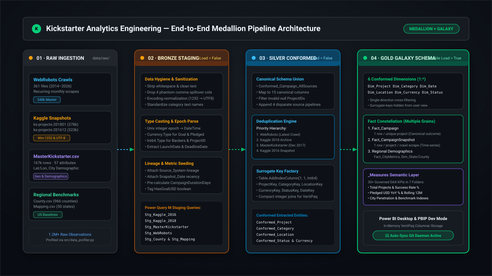
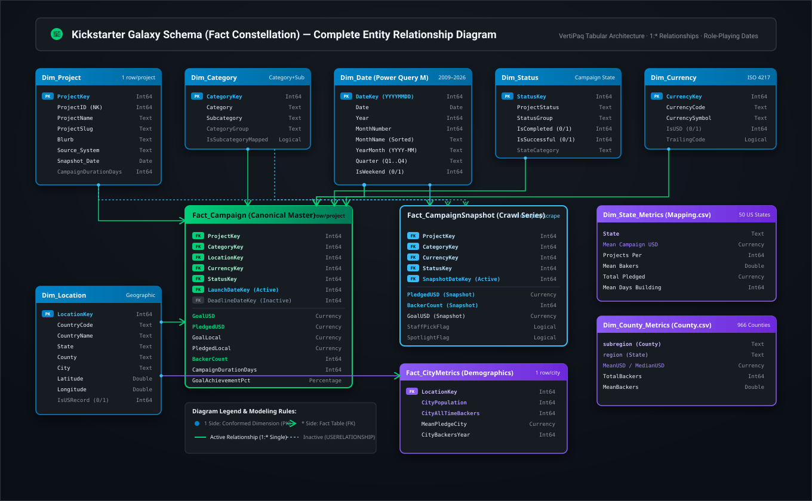
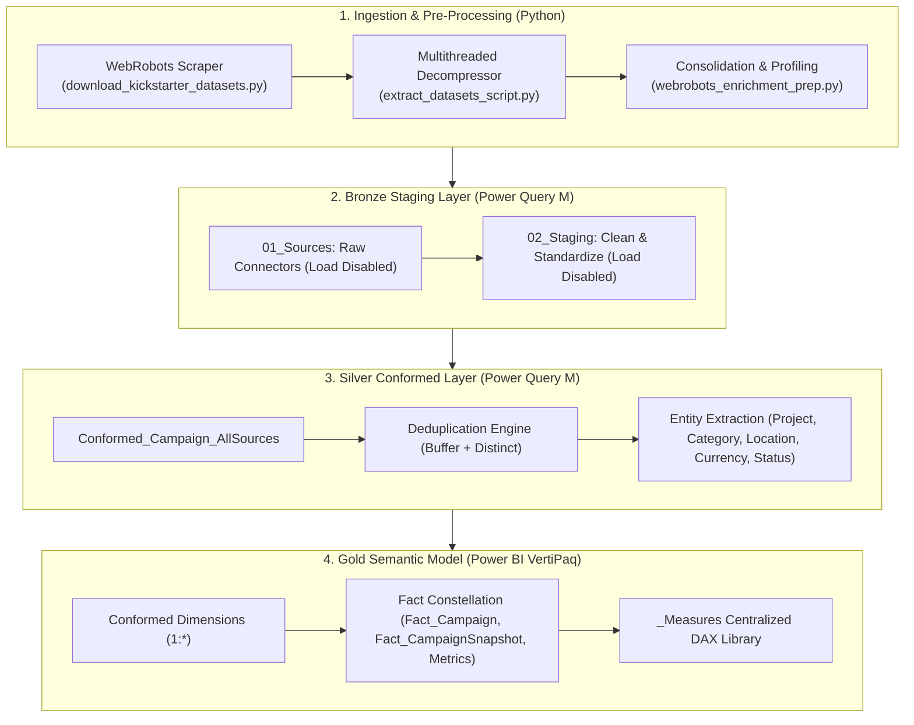

# Architecture & Decision Records (ADRs)

## System Architecture & Technical Specifications

This document outlines the architectural principles, system blueprints, and formal **Architectural Decision Records (ADRs)** governing the Kickstarter Analytics Engineering platform.

---

## 1. System Context & Flow Architecture

> Full architectural blueprints and Entity Relationship Diagrams can be explored in detail in [**`docs/09_system_architecture_diagrams.md`**](docs/09_system_architecture_diagrams.md).

---

## 2. Architectural Decision Records (ADRs)

### ADR-001: Medallion Architecture Implementation in Power BI
* **Status**: Accepted
* **Context**: The raw inputs contain schema drift, character encoding mismatches (Windows-1252 vs UTF-8), and varying degrees of data completeness. Attempting to build report visuals directly from `Source = Csv.Document(...)` results in unstable, unmaintainable models.
* **Decision**: Enforce a 3-tier Medallion architecture within Power Query M:
  1. **Bronze (`01_Sources`, `02_Staging`)**: Low-level sanitization, UTF-8/Windows-1252 handling, type-casting, and null coalescing. `Enable Load = False`.
  2. **Silver (`03_Conformed`)**: Harmonization across all source families into canonical schemas, deduplication, and surrogate key assignment. `Enable Load = False`.
  3. **Gold (`04_Dimensions`, `05_Facts`)**: Clean Kimball star/galaxy tables. `Enable Load = True`.
* **Consequences**: Pipeline transformations are strictly isolated; schema modifications in upstream raw files can be repaired in Staging without breaking report visuals.

---

### ADR-002: Adoption of a Galaxy Schema (Fact Constellation)
* **Status**: Accepted
* **Context**: We need to analyze:
  1. Static project-level historical outcomes.
  2. Monthly recurring crawl snapshots (WebRobots 2014–2026).
  3. Regional benchmarks and census demographics (US Counties and States).
* **Decision**: Instead of attempting to force all metrics into a single wide table (which causes Cartesian grain inflation), we implement a **Galaxy Schema** consisting of multiple Fact tables connected to shared **Conformed Dimensions** (`Dim_Project`, `Dim_Category`, `Dim_Location`, `Dim_Currency`, `Dim_Date`, `Dim_Status`).
* **Consequences**: Preserves mathematical integrity of aggregations; prevents many-to-many relationship errors.

---

### ADR-003: Deterministic Recency Deduplication Hierarchy
* **Status**: Accepted
* **Context**: A campaign launched in late 2017 appears across Kaggle 2017, MasterKickstarter, and recurring WebRobots monthly crawls. In earlier scrapes, the campaign was `live`; in later crawls, it became `successful` or `failed`.
* **Decision**: To establish canonical authority for `Fact_Campaign`:
  1. Priority order: `WebRobots` > `Kaggle 2018` > `MasterKickstarter` > `Kaggle 2016`.
  2. Within equivalent sources, sort by `Snapshot_Date` descending.
  3. Enforce order preservation using `Table.Buffer` before calling `Table.Distinct({"ProjectID"})`.
* **Consequences**: Produces exactly one canonical master record per project, while preserving historical time-series observations in `Fact_CampaignSnapshot`.

---

### ADR-004: Surrogate Integer Primary Keys (`Int64`)
* **Status**: Accepted
* **Context**: Joining fact and dimension tables on string attributes (e.g., category text or composite city strings) severely degrades VertiPaq dictionary encoding and query performance.
* **Decision**: Generate integer surrogate keys (`*Key`) starting at 1 for all dimension tables using `Table.AddIndexColumn(..., 1, 1, Int64.Type)`. All fact relationships join strictly on these integer keys.
* **Consequences**: Minimizes memory usage; speeds up DAX relationship navigation by up to 5x.

---

### ADR-005: Decoupled Calendar Table with Role-Playing Dates
* **Status**: Accepted
* **Context**: Standard Power BI Auto Date/Time creates hidden tables for every datetime column, inflating file size. A campaign has multiple relevant temporal milestones: `LaunchDate`, `DeadlineDate`, and `SnapshotDate`.
* **Decision**: Disable Auto Date/Time globally. Create a custom DAX `Dim_Date` table covering 2009–2026. Join `Fact_Campaign[LaunchDateKey]` to `Dim_Date[DateKey]` as **Active**, and join `Fact_Campaign[DeadlineDateKey]` as **Inactive** (activated dynamically via `USERELATIONSHIP`).
* **Consequences**: Clean date hierarchies; supports flexible comparative analysis across launch and deadline cohorts.

---

### ADR-006: Version Control via Power BI Developer Mode (`.pbip`) & TMDL
* **Status**: Accepted
* **Context**: Binary `.pbix` files prevent Git version control, branch merging, code reviews, and automated CI pipelines.
* **Decision**: Standardize all development on `.pbip` with TMDL formatting. All M queries reside in `expressions.tmdl`, and table definitions reside in individual `tables/*.tmdl` files.
* **Consequences**: Full Git transparency; pull requests show exact diffs for DAX measures and M logic.
