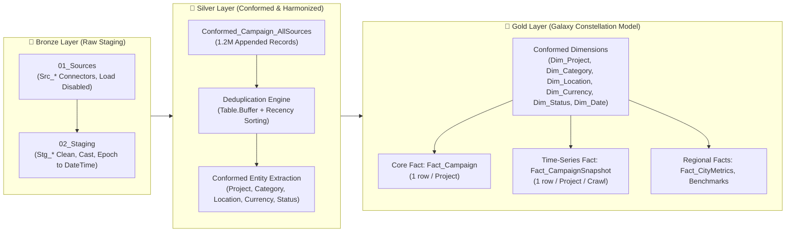
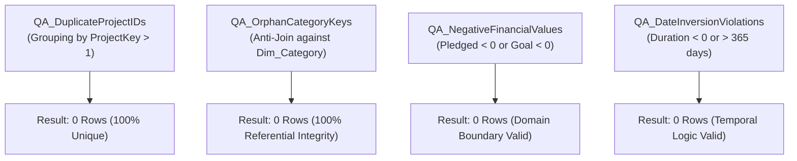
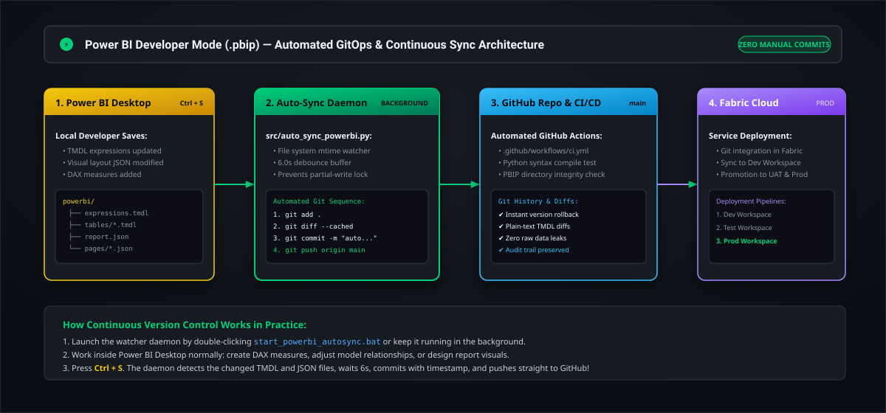

<!--
  Kickstarter Analytics Engineering Platform
  GitHub README
-->

<div align="center">

  

  <h1>Kickstarter Analytics Engineering Platform</h1>

  <p>
    <strong>A governed, enterprise-grade Power BI semantic model and Medallion data pipeline transforming 1.2M+ multi-source Kickstarter campaign records into actionable intelligence.</strong>
  </p>

  <p>
    <a href="https://github.com/Sohila-Khaled-Abbas/kickstarter-analytics-engineering">
      
    </a>
    <a href="https://learn.microsoft.com/power-bi/">
      
    </a>
    <a href="https://www.python.org/">
      
    </a>
    
    
  </p>

</div>

---

## 1. Executive Summary

Crowdfunding datasets from Kickstarter are notoriously challenging for analytics teams. When data is gathered across Kaggle historical dumps (2016, 2018), academic geospatial enrichments (MasterKickstarter), and recurring monthly web crawls (WebRobots 2014–2026), standard reporting tools face severe obstacles:
- **Schema Drift**: Attributes have mismatched naming conventions, casings, and encodings (`Windows-1252` vs `UTF-8`).
- **Temporal Overlap**: The same campaign appears across multiple annual dumps with evolving funding states (`live` → `successful` / `failed`).
- **Granularity Traps**: Denormalizing city-level population or county benchmarks into individual campaign rows leads to Cartesian explosions during aggregation.
- **Binary PBX Lock-in**: Traditional `.pbix` binary files prevent collaborative Git branching and code reviews.

This project implements an **Analytics Engineering & Power BI Developer** solution:
1. **Medallion Architecture (Bronze → Silver → Gold)** in Power Query M to decouple raw ingestion from the semantic model.
2. **Deterministic Deduplication Engine** resolving campaign lifecycle states using memory buffering and source hierarchy.
3. **Galaxy Schema (Fact Constellation)** separating granular project outcomes from time-series crawls and regional census metrics.
4. **Governed DAX Semantic Layer** of 30+ standardized KPIs categorized into 7 display folders.
5. **Code-First Version Control** using Power BI Developer Mode (`.pbip`) and Tabular Model Definition Language (TMDL).

---

## 2. Ingestion Profile & Dataset Inventory

Profiling results generated across `data/raw/` by `src/data_profiler.py`:

| Dataset | Size | Total Rows | Columns | Encoding | Business Role |
| :--- | :--- | :--- | :--- | :--- | :--- |
| **`MasterKickstarter.csv`** | 55.6 MB | 167,920 | 57 | UTF-8 | Enriched historical portfolio with coordinates, city population, and regional features. |
| **`County.csv`** | 0.06 MB | 966 | 9 | UTF-8 | Benchmark metrics aggregated by US county (`subregion`) and state (`region`). |
| **`Mapping.csv`** | <0.01 MB | 50 | 8 | UTF-8 | Benchmark metrics aggregated across 50 US states. |
| **`ks-projects-201612.csv`** | 44.35 MB | 323,750 | 17 | **Windows-1252** | Kaggle historical snapshot with unescaped commas and column shifts. |
| **`ks-projects-201801.csv`** | 55.34 MB | 378,661 | 15 | UTF-8 | Complete historical archive with Fixer.io normalized USD conversions. |
| **`WebRobots_Enrichment_Master.csv`** | 53.80 MB | 348,777 | 12 | UTF-8 | Consolidated master extracted from 361 recurring monthly/annual web crawls (2014–2026). |
| **Total Pipeline Volume** | **~210 MB** | **1,219,124** | — | — | **1.2M+ Raw Observations Unified** |

---

## 3. End-to-End Pipeline Architecture




---

## 4. The Galaxy Schema (Fact Constellation)


```mermaid
graph TD
    subgraph Dimensions["🌌 Shared Conformed Dimensions"]
        D_Date["Dim_Date<br/>(DAX Calendar 2009-2026)"]
        D_Cat["Dim_Category<br/>(CategoryKey)"]
        D_Loc["Dim_Location<br/>(LocationKey)"]
        D_Curr["Dim_Currency<br/>(CurrencyKey)"]
        D_Stat["Dim_Status<br/>(StatusKey)"]
        D_Proj["Dim_Project<br/>(ProjectKey)"]
    end

    subgraph Facts["📊 Fact Constellation (Multiple Grains)"]
        F_Camp[["Fact_Campaign<br/>Grain: 1 row / Project"]]
        F_Snap[["Fact_CampaignSnapshot<br/>Grain: 1 row / Project / Scrape"]]
        F_City[["Fact_CityMetrics<br/>Grain: 1 row / City"]]
        F_State[["Dim_State_Metrics<br/>Grain: 1 row / US State"]]
        F_County[["Dim_County_Metrics<br/>Grain: 1 row / US County"]]
    end

    %% Fact_Campaign Links
    D_Date -->|LaunchDateKey (Active)| F_Camp
    D_Date -.->|DeadlineDateKey (Inactive)| F_Camp
    D_Cat --> F_Camp
    D_Loc --> F_Camp
    D_Curr --> F_Camp
    D_Stat --> F_Camp
    D_Proj --> F_Camp

    %% Fact_CampaignSnapshot Links
    D_Date -->|SnapshotDateKey (Active)| F_Snap
    D_Cat --> F_Snap
    D_Curr --> F_Snap
    D_Stat --> F_Snap
    D_Proj --> F_Snap

    %% Geo Metric Links
    D_Loc --> F_City
    D_Loc --> F_State
    D_Loc --> F_County
```

### Table Grains & Cardinality
| Table Name | Layer | Grain Definition | Cardinality | Filter Direction |
| :--- | :--- | :--- | :--- | :--- |
| **`Dim_Project`** | Dimension | 1 row per unique project | `1 : *` to Fact | Single |
| **`Dim_Category`** | Dimension | 1 row per Category + Subcategory | `1 : *` to Fact | Single |
| **`Dim_Location`** | Dimension | 1 row per City + State + Country | `1 : *` to Fact | Single |
| **`Dim_Currency`** | Dimension | 1 row per ISO currency code | `1 : *` to Fact | Single |
| **`Dim_Status`** | Dimension | 1 row per outcome status | `1 : *` to Fact | Single |
| **`Dim_Date`** | Dimension | 1 row per calendar day (2009–2026) | `1 : *` to Fact | Single |
| **`Fact_Campaign`** | Core Fact | 1 row per unique project (Canonical) | `* : 1` to Dims | Single |
| **`Fact_CampaignSnapshot`** | Longitudinal Fact | 1 row per project per scrape event | `* : 1` to Dims | Single |
| **`Fact_CityMetrics`** | Aggregate Fact | 1 row per municipal city | `* : 1` to `Dim_Location` | Single |
| **`Dim_State_Metrics`** | Benchmark | 1 row per US State | Benchmark | Disconnected / Joined |
| **`Dim_County_Metrics`**| Benchmark | 1 row per US County | Benchmark | Disconnected / Joined |

---

## 5. Comprehensive Step-by-Step Documentation

The implementation is broken down into 9 step-by-step technical guides in [`docs/`](docs/):

| Step | Guide Document | Focus Areas |
| :---: | :--- | :--- |
| **00** | [**Project Architecture & Setup**](docs/00_project_architecture_and_setup.md) | Medallion philosophy, PBIP setup, query groups (`00_Parameters` to `99_QA`), parameters. |
| **01** | [**Source Data Profiling & Ingestion**](docs/01_source_data_profiling_and_ingestion.md) | Profiling all CSVs, character encodings, column shift anomalies, `Src_*` connection M code. |
| **02** | [**Power Query Staging Layer (Bronze)**](docs/02_power_query_staging_layer_bronze.md) | Exact runnable M code for all staging tables, UNIX timestamp conversion, data cleaning. |
| **03** | [**Conformed Layer (Silver)**](docs/03_power_query_conformed_layer_silver.md) | Canonical schema harmonization, deterministic deduplication hierarchy, surrogate keys. |
| **04** | [**Dimensional Modeling (Gold)**](docs/04_dimensional_modeling_and_galaxy_schema_gold.md) | Galaxy schema rules, DAX calendar table script, 1:* relationships, role-playing dates. |
| **05** | [**DAX Semantic Layer & Measures**](docs/05_dax_semantic_layer_and_measure_library.md) | Centralized `_Measures` table, 30+ KPIs across 7 display folders with formatting. |
| **06** | [**Data Quality Testing & Reconciliation**](docs/06_data_quality_testing_and_reconciliation.md) | dbt-style assertion queries in M (`99_QA`), DAX health measures, Python profiler tests. |
| **07** | [**Power BI Visual Design & UX Playbook**](docs/07_power_bi_visual_design_and_ux_playbook.md) | Kickstarter color tokens, 5 core report page wireframes, bookmarks, tooltips, drill-throughs. |
| **08** | [**Git, PBIP & CI/CD Deployment**](docs/08_git_pbip_and_ci_cd_deployment_workflow.md) | TMDL version control, branch flow, PR review checklist, Fabric deployment pipelines. |
| **09** | [**System Architecture & Diagrams**](docs/09_system_architecture_diagrams.md) | High-resolution visual diagrams (Medallion flow, Galaxy schema ERD, GitOps). |

---

## 6. Governed DAX Semantic Layer Showcase

All measures reside in `_Measures` organized across **7 Display Folders**:

### Core Portfolio KPIs
```dax
Total Projects = DISTINCTCOUNT(Fact_Campaign[ProjectKey])

Total Pledged USD = SUM(Fact_Campaign[PledgedUSD])

Total Goal USD = SUM(Fact_Campaign[GoalUSD])

Total Backers = SUM(Fact_Campaign[BackerCount])

Overall Funding Ratio % = DIVIDE([Total Pledged USD], [Total Goal USD], 0)
```

### Governed Success & Velocity Logic
```dax
Completed Projects = 
CALCULATE([Total Projects], KEEPFILTERS(Dim_Status[IsCompleted] = 1))

Successful Projects = 
CALCULATE([Total Projects], KEEPFILTERS(Dim_Status[ProjectStatus] = "Successful"))

Completed Success Rate % = 
DIVIDE([Successful Projects], [Completed Projects], 0)

Average Campaign Duration (Days) = 
AVERAGE(Fact_Campaign[CampaignDurationDays])
```

### Time Intelligence YoY
```dax
Pledged USD YoY % = 
VAR CurrentPledged = [Total Pledged USD]
VAR PriorYearPledged = CALCULATE([Total Pledged USD], SAMEPERIODLASTYEAR(Dim_Date[Date]))
RETURN
DIVIDE(CurrentPledged - PriorYearPledged, PriorYearPledged, BLANK())
```

### Role-Playing Deadline Date
```dax
Pledged USD by Deadline Date = 
CALCULATE(
    [Total Pledged USD],
    USERELATIONSHIP(Fact_Campaign[DeadlineDateKey], Dim_Date[DateKey])
)
```

---

## 7. Quality Assurance & Automated Assertions

In accordance with analytics engineering standards, model integrity is enforced through **automated diagnostic queries (`99_QA`)** that must return **0 rows**:



---

## 8. Automated Power BI GitOps & Continuous Publishing

Whenever modifications are made inside Power BI Desktop, the background auto-sync daemon automatically detects file saves, stages modified TMDL/JSON files, creates an ISO timestamped commit, and publishes to GitHub:



### Zero-Friction Workflow:
1. Double-click [`start_powerbi_autosync.bat`](start_powerbi_autosync.bat) (or keep the background daemon running).
2. Edit models, DAX measures, or canvas visuals in Power BI Desktop normally.
3. Press **`Ctrl + S`**: The daemon detects the file update, waits 6 seconds for write completion, commits, and pushes straight to GitHub!

---

## 9. Repository Structure

```text
kickstarter-analytics-engineering/
├── .github/
│   ├── workflows/
│   │   ├── ci.yml                           # GitHub Actions CI workflow
│   │   └── data_quality_check.yml           # Automated data validation workflow
│   ├── ISSUE_TEMPLATE/
│   │   ├── bug_report.md
│   │   └── feature_request.md
│   └── pull_request_template.md             # Analytics engineering PR template
├── assets/
│   ├── Kickstarter Color Palette - color-hex.com.png
│   └── kickstarter-brand-assets/            # Brand logos & badges
├── docs/                                    # Exhaustive 9-part step-by-step documentation
│   ├── 00_project_architecture_and_setup.md
│   ├── 01_source_data_profiling_and_ingestion.md
│   ├── 02_power_query_staging_layer_bronze.md
│   ├── 03_power_query_conformed_layer_silver.md
│   ├── 04_dimensional_modeling_and_galaxy_schema_gold.md
│   ├── 05_dax_semantic_layer_and_measure_library.md
│   ├── 06_data_quality_testing_and_reconciliation.md
│   ├── 07_power_bi_visual_design_and_ux_playbook.md
│   ├── 08_git_pbip_and_ci_cd_deployment_workflow.md
│   └── data_profiling_report.md             # Generated profiling stats
├── powerbi/                                 # Power BI Developer Mode (.pbip) Project
│   ├── kickstarter_analytics.pbip           # PBIP pointer
│   ├── kickstarter_analytics.Report/        # Visual definitions & canvas pages
│   └── kickstarter_analytics.SemanticModel/ # TMDL data model, tables & expressions
├── src/                                     # Ingestion & automation tooling
│   ├── download_kickstarter_datasets.py     # Asynchronous WebRobots scraper
│   ├── extract_datasets_script.py           # Multithreaded decompression
│   ├── prepare_raw_webrobots_data.py        # Crawl organizing & copying
│   ├── webrobots_enrichment_prep.py         # Enrichment prep & deduplication
│   ├── generate_metadata.py                 # Metadata catalog generator
│   ├── data_profiler.py                     # Deep statistical profiler
│   └── validate_semantic_model.py           # TMDL syntax & query group validator
├── .gitignore                               # Enterprise PBIP & large data ignore rules
├── ARCHITECTURE.md                          # Architectural Decision Records (ADRs)
├── CHANGELOG.md                             # Version history
├── CONTRIBUTING.md                          # Engineering contribution standards
├── DATA_DICTIONARY.md                       # Canonical data catalog & dictionary
├── LICENSE                                  # MIT License
├── README.md                                # Platform documentation
└── requirements.txt                         # Python dependencies
```

---

## 10. Quickstart: Reproducing Locally

### 1. Clone & Set Up Python
```bash
git clone https://github.com/Sohila-Khaled-Abbas/kickstarter-analytics-engineering.git
cd kickstarter-analytics-engineering

python -m venv .venv
# Windows:
.venv\Scripts\activate
# Mac/Linux:
source .venv/bin/activate

pip install -r requirements.txt
```

### 2. Run Data Profiling & Validation
```bash
python src/data_profiler.py
python src/validate_semantic_model.py
```

### 3. Open in Power BI Desktop
1. Ensure **Power BI Desktop** has **Power BI Project (.pbip) save option** enabled in Options > Preview Features.
2. Double-click `powerbi/kickstarter_analytics.pbip`.
3. In Power Query, verify `DataFolderPath` matches your local path.
4. Click **Apply Changes** to build the in-memory VertiPaq tabular model.

---

## 11. License

This project is licensed under the MIT License — see the [LICENSE](LICENSE) file for details.
