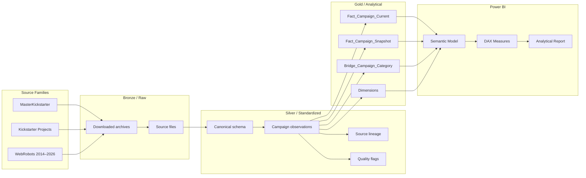
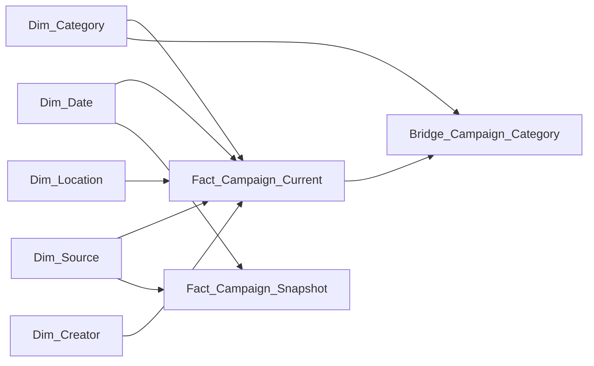

<!--
  Kickstarter Analytics Engineering
  GitHub README
-->

<div align="center">

  

  <h1>Kickstarter Analytics Engineering</h1>

  <p>
    <strong>From fragmented Kickstarter snapshots and recurring crawls to a governed Power BI analytical model.</strong>
  </p>

  <p>
    <a href="https://github.com/Sohila-Khaled-Abbas/kickstarter-analytics-engineering">
      
    </a>
    <a href="https://www.python.org/">
      
    </a>
    <a href="https://learn.microsoft.com/power-bi/">
      
    </a>
    <a href="https://mermaid.js.org/">
      
    </a>
    
    
  </p>

</div>

---

## 1. Project Overview

This project is an **Analytics Engineering + Power BI** implementation for studying Kickstarter campaigns across multiple historical and recurring data sources.

The engineering problem is not simply to build charts from one CSV. The project is designed around a more realistic analytical workflow:

> **Discover → extract → register → standardize → reconcile → deduplicate → model → measure → analyze**

The repository combines three source families:

| Source family | Current files / layout | Role in the pipeline |
|---|---|---|
| **MasterKickstarter** | `MasterKickstarter.csv`, `County.csv`, `Mapping.csv` | Historical campaign data + reference/mapping tables |
| **Kickstarter Projects** | `ks-projects-201612.csv`, `ks-projects-201801.csv` | Historical Kaggle snapshots |
| **WebRobots** | Year-organized crawls, 2014–2026 | Recurring Kickstarter crawls used for temporal coverage and cross-source reconciliation |

The raw datasets are intentionally **not committed to Git**. The repository contains the code, metadata logic, documentation, Power BI project files, and assets needed to reproduce the analytical workflow.

---

## 2. Why This Project Is an Analytics Engineering Project

The project focuses on the problems that appear when analytical data comes from heterogeneous sources:

- **Schema drift** — the same business concept can have different column names or structures.
- **Temporal overlap** — the same campaign can appear in multiple snapshots and crawls.
- **Source reconciliation** — different sources may report the same campaign at different points in time.
- **Row-level duplication** — WebRobots documents possible duplication caused by collecting through Kickstarter subcategories.
- **Data lineage** — analytical records need to be traceable to their source file and snapshot.
- **Data quality** — invalid keys, dates, nulls, and referential-integrity issues should be detected before reporting.
- **Semantic modeling** — the final Power BI layer should represent business entities and facts rather than a single flat ingestion table.

The resulting architecture separates the **observation of a campaign** from the **latest selected campaign record**.

---

## 3. Architecture

### End-to-end data flow



This diagram is a high-level representation of the intended pipeline. GitHub supports Mermaid diagrams in Markdown, while Mermaid supports flowcharts, subgraphs, labels, and class-based styling for richer documentation.

### Target analytical grain

The most important modeling decision is to preserve two different grains:

| Table | Grain | Main question |
|---|---|---|
| `Fact_Campaign_Snapshot` | One campaign observation per source/snapshot | **How did a campaign evolve over time?** |
| `Fact_Campaign_Current` | One surviving record per `project_id` | **What is the latest available analytical state of the campaign?** |
| `Bridge_Campaign_Category` | One campaign-to-category relationship | **Which categories are associated with the campaign?** |

This prevents historical observations from being destroyed simply because the reporting layer needs one current row per campaign.

---

## 4. Data Engineering Lifecycle

### 1. Discovery

`download_kickstarter_datasets.py` discovers WebRobots dataset links from the public Kickstarter dataset page and identifies supported archive formats.

### 2. Latest-per-year selection

The downloader groups WebRobots datasets by year, selects the latest available scrape for each year, prefers CSV when both CSV and JSON are available, and falls back to JSON otherwise.

> **Important:** “latest-per-year” means the latest crawl available for that year. It should not be interpreted as a guarantee that every historical campaign was captured in its final state.

### 3. Parallel extraction and resilient downloading

The current downloader uses:

- asynchronous HTTP requests via **aiohttp**
- concurrent network connections
- HTTP range requests for large files when supported
- resumable partial downloads
- retry and backoff handling
- progress reporting via **tqdm**

The extraction utility then expands `.zip` and `.json.gz` archives into isolated year/scrape directories.

### 4. Raw WebRobots preparation

`prepare_raw_webrobots_data.py` converts extracted WebRobots files into a Power BI-friendly raw folder and encodes year/scrape information into destination filenames to avoid overwrites.

### 5. Metadata registration

`generate_metadata.py` profiles the raw source folders and creates:

- `dataset_manifest.csv`
- `schema_registry.csv`

The current metadata generator records source family, file name, relative path, file size, row count, column count, and column names.

### 6. Standardization

Each source family should be transformed into a canonical analytical schema before any union/append.

Typical canonical fields include:

`project_id`, `name`, `state`, `goal_usd`, `pledged_usd`, `backers_count`, `launch_datetime`, `deadline_datetime`, `creator_id`, `category_id`, `country`, `source_system`, and `source_snapshot_date`.

### 7. Reconciliation

Overlapping campaign records should be compared before they are collapsed into a single current record.

Examples of reconciliation fields:

- goal
- pledged amount
- backer count
- state
- launch date
- deadline
- category
- location

### 8. Survivorship

For the current-state analytical table, the proposed deterministic survivorship hierarchy is:

```
Business key: project_id

1. Most recent source snapshot
2. Source precedence when timestamps are tied
3. Highest record completeness
4. Deterministic source-record tie-breaker
```

The exact rule should be documented in the transformation layer rather than hidden inside a visual-level transformation.

---

## 5. Source Inventory

### MasterKickstarter

Current repository references:

```text
data/raw/master_kickstarter/
├── MasterKickstarter.csv
├── County.csv
└── Mapping.csv
```

The campaign dataset is treated as a historical source, while `County.csv` and `Mapping.csv` are treated as reference/mapping inputs until their keys and relationships are formally validated.

**Source:** [Kaggle — MapKickstarter / MasterKickstarter](https://www.kaggle.com/wood2174/mapkickstarter#MasterKickstarter.csv)

### Kickstarter Projects

Current files:

```text
data/raw/kickstarter_projects/
├── ks-projects-201612.csv
└── ks-projects-201801.csv
```

These datasets are used as historical snapshots and are valuable for cross-source reconciliation with WebRobots.

**Source:** [Kaggle — Kickstarter Projects](https://www.kaggle.com/datasets/kemical/kickstarter-projects)

### WebRobots

WebRobots publishes Kickstarter crawl datasets in CSV and JSON formats and documents recurring monthly crawls from March 2016. The source page also documents older snapshots, Unix timestamps, compressed file sizes, historical collection limitations, and the possibility of duplicate projects after the collection approach changed to traverse subcategories in December 2015.

**Source:** [WebRobots — Kickstarter Datasets](https://webrobots.io/kickstarter-datasets/)

<details>
<summary><strong>Why WebRobots requires special handling</strong></summary>

WebRobots' own documentation identifies several modeling considerations:

1. **Historical coverage limitations:** from April 2015, Kickstarter limited how many projects could be viewed in a single category, which affected the amount of historical data available in a single scrape.
2. **Category duplication:** from December 2015, collection moved through subcategories rather than only top-level categories, which can result in the same project appearing in multiple categories.
3. **Timestamp format:** the source uses Unix timestamps.
4. **Large compressed files:** source archives can be large enough that parallel and resumable downloading is useful.

These source characteristics are treated as **engineering constraints**, not as data-cleaning errors.

</details>

---

## 6. Repository Structure

The repository currently follows this layout:

```text
kickstarter-analytics-engineering/
│
├── .gitignore
├── README.md
├── requirements.txt
│
├── assets/
│   ├── Kickstarter Color Palette - color-hex.com.png
│   └── kickstarter-brand-assets/
│       ├── kickstarter-logo-green.png
│       ├── kickstarter-logo-green.eps
│       ├── kickstarter-logo-k-green.png
│       ├── kickstarter-logo-k-green.eps
│       ├── kickstarter-logo-k-white.png
│       ├── kickstarter-logo-k-white.eps
│       ├── kickstarter-logo-white.png
│       └── kickstarter-logo-white.eps
│
├── docs/
│   ├── Data Source.txt
│   ├── github_publishing_guide.md
│   ├── kickstarter_analytics_engineering_playbook.md
│   ├── kickstarter_script_execution_guide.md
│   └── senior_power_bi_guide_power_query_edition.md
│
├── powerbi/
│   ├── kickstarter_analytics.pbip
│   ├── kickstarter_analytics.Report/
│   │   ├── .platform
│   │   └── definition.pbir
│   └── kickstarter_analytics.SemanticModel/
│       ├── .platform
│       ├── definition.pbism
│       └── definition/
│           ├── database.tmdl
│           ├── model.tmdl
│           └── cultures/
│               └── en-US.tmdl
│
└── src/
    ├── download_kickstarter_datasets.py
    ├── extract_datasets_script.py
    ├── generate_metadata.py
    └── prepare_raw_webrobots_data.py
```

### Local data lifecycle

The raw data itself is excluded by `.gitignore`. A typical working directory can contain:

```text
data/
├── <year>/                         # downloaded WebRobots archives
├── extracted/
│   └── <year>/<scrape>/
├── raw/
│   ├── master_kickstarter/
│   ├── kickstarter_projects/
│   └── webrobots/
└── metadata/
    ├── dataset_manifest.csv
    └── schema_registry.csv
```

The exact local path is configurable in the Python scripts.

---

## 7. Source-to-Model Design

### Bronze

The Bronze layer is intentionally close to the original source:

- original files
- archive structure
- source filenames
- source family
- crawl/snapshot context

### Silver

The Silver layer creates the **canonical campaign observation**:

```text
project_id
source_system
source_file
source_snapshot_date
name
state
goal_native
goal_usd
pledged_native
pledged_usd
backers_count
launch_datetime
deadline_datetime
creator_id
category_id
location
...
```

This is where naming, types, timestamps, null handling, and source-specific parsing belong.

### Gold

The Gold layer is designed for Power BI:

```text
Fact_Campaign_Current
Fact_Campaign_Snapshot
Bridge_Campaign_Category

Dim_Date
Dim_Category
Dim_Creator
Dim_Location
Dim_Source
Dim_Campaign
```

---

## 8. Power BI Semantic Model

### Target star-schema design



### Why two facts?

A single-row-per-project table is excellent for executive reporting but loses the temporal sequence of campaign observations.

The snapshot fact preserves observations such as:

```text
Project A
 ├── Crawl 01 → live → $2,500
 ├── Crawl 02 → live → $8,900
 └── Crawl 03 → successful → $15,200
```

That enables analysis of:

- funding velocity
- backer velocity
- momentum
- state transitions
- time-to-goal
- campaign trajectories

The current-state fact can then answer:

- total projects
- success rate
- total pledged
- median goal
- pledge per backer
- category performance
- geography performance

---

## 9. Power BI Project & Git Strategy

This repository uses **Power BI Project (`.pbip`)** rather than relying exclusively on a monolithic `.pbix` file.

The committed project contains:

- a `.pbip` project entry point
- a report folder
- a semantic-model folder
- TMDL model definition files
- a PBIR report definition

Microsoft documents PBIP as a source-control-oriented project format, with TMDL providing human-readable semantic-model definitions and PBIR organizing report artifacts into files suitable for version control and collaboration.

**Official references:**

- [Power BI Desktop developer mode](https://learn.microsoft.com/en-us/power-bi/developer/projects/)
- [Power BI project semantic model](https://learn.microsoft.com/en-us/power-bi/developer/projects/projects-dataset)
- [Power BI Project Git integration](https://learn.microsoft.com/power-bi/developer/projects/projects-git)
- [Power BI enhanced report format / PBIR](https://learn.microsoft.com/en-us/power-bi/developer/embedded/projects-enhanced-report-format)

<details>
<summary><strong>Why PBIP/TMDL/PBIR matters</strong></summary>

A PBIP project exposes report and semantic-model definitions as source-control-friendly files instead of forcing the entire analytical artifact into a single binary file.

That makes it possible to review changes such as:

- DAX measure changes
- semantic model changes
- report metadata changes
- page/visual changes
- relationship changes

through normal Git workflows.

</details>

---

## 10. Core Analytics

The semantic layer is intended to support measures such as:

```DAX
Projects :=
DISTINCTCOUNT(Fact_Campaign_Current[project_id])
```

```DAX
Successful Projects :=
CALCULATE(
    [Projects],
    Fact_Campaign_Current[state] = "successful"
)
```

```DAX
Success Rate :=
DIVIDE(
    [Successful Projects],
    [Projects]
)
```

```DAX
Total Pledged :=
SUM(Fact_Campaign_Current[pledged_usd])
```

```DAX
Total Goal :=
SUM(Fact_Campaign_Current[goal_usd])
```

```DAX
Goal Achievement :=
DIVIDE(
    [Total Pledged],
    [Total Goal]
)
```

```DAX
Pledge Per Backer :=
DIVIDE(
    [Total Pledged],
    SUM(Fact_Campaign_Current[backers_count])
)
```

### Recommended analytical features

To move beyond descriptive reporting, the project can derive:

| Feature | Analytical purpose |
|---|---|
| Campaign duration | Measure the length of campaigns |
| Funding multiple | Compare pledged amount with goal |
| Goal buckets | Study nonlinear relationships with success |
| Median / percentile metrics | Handle highly skewed financial distributions |
| Launch cohorts | Compare campaign performance across years/months |
| Funding velocity | Measure change in pledged amount between snapshots |
| Backer velocity | Measure change in backer count between snapshots |
| State transitions | Study live → successful/failed/canceled pathways |

---

## 11. Data Quality Framework

The next-generation quality layer should validate the data **before** it becomes a report.

Recommended tests:

```text
QA_DuplicateProjectIDs
QA_NullProjectIDs
QA_InvalidDates
QA_InvalidStates
QA_MissingCategories
QA_MissingLocations
QA_NegativeFinancialValues
QA_SourceOverlap
QA_OrphanDimensionKeys
QA_SchemaDrift
```

### Example business rules

```text
project_id must not be null

deadline_datetime >= launch_datetime

goal_usd >= 0

pledged_usd >= 0

backers_count >= 0

every fact category key must exist in Dim_Category
```

The correct response to a data-quality problem is usually to **flag and investigate** it rather than silently deleting the record.

---

## 12. Deduplication Strategy

The project distinguishes **file-level duplication** from **campaign-level duplication**.

### File-level

Use the source identity and, in the target architecture, a content hash such as SHA-256 to identify exact file duplicates.

### Campaign-level

Use:

`project_id`

as the business key for the current-state campaign table.

Do not automatically deduplicate category relationships by `project_id`. WebRobots documents that a project can appear under multiple subcategories, so category membership may be a legitimate many-to-many relationship.

### Recommended survivorship ordering

```text
project_id
    ↓
latest source snapshot
    ↓
source precedence
    ↓
record completeness
    ↓
deterministic tie-breaker
```

This is intentionally different from simply sorting on `updated_at`.

A campaign's internal update timestamp describes the campaign; a source snapshot timestamp describes **when that source observed it**.

---

## 13. Running the Pipeline

### Prerequisites

- Python 3.9+
- Power BI Desktop
- Git
- Access to the local source datasets
- Sufficient disk space for compressed and extracted WebRobots data

### 1. Clone

```bash
git clone https://github.com/Sohila-Khaled-Abbas/kickstarter-analytics-engineering.git
cd kickstarter-analytics-engineering
```

### 2. Create a virtual environment

PowerShell:

```powershell
python -m venv .venv
.\.venv\Scripts\Activate.ps1
```

Command Prompt:

```cmd
python -m venv .venv
.\.venv\Scripts\activate
```

### 3. Install dependencies

```bash
pip install -r requirements.txt
```

The current `requirements.txt` contains:

```text
aiohttp==3.9.5
beautifulsoup4==4.12.3
tqdm==4.66.4
```

**Setup note:** `generate_metadata.py` imports `pandas`. Until that dependency is added to `requirements.txt`, install it explicitly:

```bash
pip install pandas
```

### 4. Configure the data directory

The current Python scripts contain a Windows path such as:

```text
D:\courses\Data Analysis 26-27\Projects\Kickstarter Projects\data
```

Update the `BASE_DIR` / `OUTPUT_DIR` constants to match your local machine before execution.

### 5. Download the selected WebRobots datasets

```bash
python src/download_kickstarter_datasets.py
```

### 6. Extract the downloaded archives

```bash
python src/extract_datasets_script.py
```

### 7. Prepare raw WebRobots files for Power BI

```bash
python src/prepare_raw_webrobots_data.py
```

### 8. Generate metadata

```bash
python src/generate_metadata.py
```

### 9. Open the Power BI Project

Open:

```text
powerbi/kickstarter_analytics.pbip
```

The repository currently contains PBIP/TMDL/PBIR scaffolding; the detailed analytical facts, dimensions, measures, and report pages are the next implementation layer.

---

## 14. Power Query Design

The intended Power Query organization is:

```text
00 Parameters
01 Sources
02 Staging
03 Standardization
04 Quality
05 Business Logic
06 Dimensions
07 Facts
99 QA
```

Recommended query naming:

```text
stg_Master
stg_KaggleProjects
stg_WebRobots

int_CampaignUnion
int_CampaignObservations
int_CampaignSurvivorship
int_CampaignCategory

Dim_Date
Dim_Category
Dim_Creator
Dim_Location
Dim_Source

Fact_Campaign_Current
Fact_Campaign_Snapshot
Bridge_Campaign_Category
```

The Power Query layer should own source-specific parsing and standardization. The semantic model should own analytical relationships and measures.

---

## 15. Analytical Questions

The report is designed around questions rather than a collection of unrelated charts.

### Campaign performance

- Which categories have the highest success rates?
- How does success rate change across time?
- Which countries produce the most successful campaigns?
- Does a higher goal correspond to a lower success probability?
- What is the relationship between goal size and funding achievement?

### Campaign economics

- What is the median campaign goal?
- What is the median amount pledged?
- How many backers does a typical campaign attract?
- How much is pledged per backer?
- Which categories overperform relative to their goal sizes?

### Campaign dynamics

- Does early funding momentum predict success?
- How quickly do backers accumulate?
- How do campaign trajectories differ between successful and unsuccessful campaigns?
- Which campaign durations are associated with better outcomes?

### Data reconciliation

- How much overlap exists between Kaggle and WebRobots?
- Which projects are source-specific?
- How often do overlapping source records disagree?
- Which source wins under the survivorship policy?

---

## 16. Suggested Report Pages

```text
01 — Executive Overview
02 — Campaign Success & Failure
03 — Category Performance
04 — Geography
05 — Goals, Pledges & Backers
06 — Time & Cohorts
07 — Campaign Dynamics
08 — Source Reconciliation
09 — Data Quality
```

### Page 01 — Executive Overview

Recommended KPIs:

- Projects
- Successful projects
- Success rate
- Total pledged
- Total goals
- Median goal
- Median pledged
- Pledge per backer

### Page 07 — Campaign Dynamics

Use the snapshot fact to visualize:

- pledged over campaign time
- backer growth
- funding velocity
- state transitions
- successful vs unsuccessful trajectories

### Page 08 — Source Reconciliation

This page demonstrates that the integration is trustworthy.

Recommended metrics:

```text
Kaggle rows
WebRobots rows
Raw combined rows
Unique projects
Duplicate observations
Kaggle-only projects
WebRobots-only projects
Source conflicts
```

---

## 17. Roadmap

- [x] Establish repository structure
- [x] Add source references
- [x] Add asynchronous WebRobots downloader
- [x] Add latest-per-year CSV/JSON selection
- [x] Add archive extraction utility
- [x] Add WebRobots preparation utility
- [x] Add metadata and schema registry generation
- [x] Add PBIP project scaffolding
- [x] Add engineering playbooks
- [ ] Complete canonical source-to-target mappings
- [ ] Implement campaign observation model
- [ ] Implement deterministic survivorship
- [ ] Build category bridge
- [ ] Build Power BI star schema
- [ ] Add DAX measure layer
- [ ] Add automated data-quality checks
- [ ] Add reconciliation page
- [ ] Add campaign snapshot analytics
- [ ] Optimize Power BI model and refresh strategy
- [ ] Add automated validation / CI checks

---

## 18. Documentation Map

| Document | Purpose |
|---|---|
| [Analytics Engineering Playbook](docs/kickstarter_analytics_engineering_playbook.md) | Core integration, deduplication, and modeling strategy |
| [Senior Power BI / Power Query Guide](docs/senior_power_bi_guide_power_query_edition.md) | Power Query-oriented implementation guidance |
| [Script Execution Guide](docs/kickstarter_script_execution_guide.md) | Running the downloader and extraction utilities |
| [GitHub Publishing Guide](docs/github_publishing_guide.md) | Git and repository publishing practices |
| [Data Source](docs/Data%20Source.txt) | Source URLs used by the project |

---

## 19. GitHub Markdown Features Used

This README intentionally uses features supported by GitHub's current Markdown renderer:

- badges from [Shields.io](https://shields.io/)
- HTML alignment and image embedding
- collapsible `<details>` sections
- Markdown tables
- task lists
- fenced code blocks with syntax identifiers
- Mermaid diagrams
- relative links to repository documentation

GitHub documents tables, collapsible sections, code blocks, task lists, diagrams, and other advanced formatting under its advanced Markdown guidance. Shields.io provides customizable static badges and badge styles such as `flat-square` and `for-the-badge`.

<details>
<summary><strong>Why use HTML inside a Markdown README?</strong></summary>

GitHub Markdown allows selected HTML to complement Markdown when ordinary Markdown does not provide enough layout control.

This README uses HTML for presentation only:

```html
<div align="center">
  
</div>
```

and for progressive disclosure:

```html
<details>
<summary>Expandable section</summary>

Technical detail goes here.

</details>
```

The goal is to improve navigation and readability without turning the README into an HTML document.

</details>

---

## 20. Engineering Principles

### Reproducibility

A transformation should be understandable and repeatable from raw source to report.

### Deterministic logic

When several source rows can represent one business entity, the winning record must be selected by an explicit rule.

### Preserve information before aggregating

Historical snapshots should be retained until the analytical grain is intentionally defined.

### Separate ingestion from semantics

Source parsing belongs in ingestion/standardization. Business metrics belong in the semantic model.

### Treat quality as part of the pipeline

A dashboard should not be the first place a data problem is discovered.

### Optimize for maintainability

Prefer modular Python utilities, reusable Power Query functions, documented mappings, and source-control-friendly Power BI artifacts.

---

## 21. Data Governance & Reproducibility

Raw datasets are excluded from this repository because the project is designed to keep **source data separate from source code and analytical definitions**.

The `.gitignore` excludes:

```text
data/
*.csv
*.json
*.json.gz
*.zip
*.parquet
*.pbix
```

This keeps Git focused on:

- transformation logic
- metadata logic
- documentation
- Power BI definitions
- reusable assets

Before redistributing any source datasets, review the terms and licensing conditions attached to the original source providers.

---

## 22. Known Implementation Notes

This repository is actively evolving. A few implementation details are intentionally documented rather than hidden:

1. The Python scripts currently use a local Windows data path that must be changed for another machine.
2. `generate_metadata.py` imports `pandas`, while the current `requirements.txt` does not yet pin it.
3. The PBIP semantic model currently contains the project scaffolding and TMDL definitions, but the full star-schema implementation is still part of the roadmap.
4. The downloader's latest-per-year rule selects the latest available crawl for each year; it does not guarantee complete historical coverage or a final-state observation for every project.
5. Category relationships should be modeled carefully because WebRobots documents possible multi-category duplication.

Documenting these constraints makes the repository more reproducible and easier to review.

---

## 23. Useful External Documentation

| Topic | Reference |
|---|---|
| GitHub Markdown | [GitHub — Writing and formatting on GitHub](https://docs.github.com/en/get-started/writing-on-github/getting-started-with-writing-and-formatting-on-github) |
| GitHub advanced formatting | [GitHub — Working with advanced formatting](https://docs.github.com/en/get-started/writing-on-github/working-with-advanced-formatting) |
| Collapsible sections | [GitHub — Organizing information with collapsed sections](https://docs.github.com/en/get-started/writing-on-github/working-with-advanced-formatting/organizing-information-with-collapsed-sections) |
| Mermaid diagrams | [GitHub — Creating diagrams](https://docs.github.com/en/get-started/writing-on-github/working-with-advanced-formatting/creating-diagrams) |
| Mermaid flowcharts | [Mermaid — Flowchart syntax](https://mermaid.js.org/syntax/flowchart.html) |
| Shields badges | [Shields.io — Badges](https://shields.io/badges) |
| Power BI developer mode | [Microsoft Learn — Power BI Desktop developer mode](https://learn.microsoft.com/en-us/power-bi/developer/projects/) |
| PBIP semantic model | [Microsoft Learn — Power BI project semantic model](https://learn.microsoft.com/en-us/power-bi/developer/projects/projects-dataset) |
| PBIP Git integration | [Microsoft Learn — Git integration with Power BI Desktop projects](https://learn.microsoft.com/power-bi/developer/projects/projects-git) |
| Kickstarter source | [WebRobots — Kickstarter Datasets](https://webrobots.io/kickstarter-datasets/) |

---

## 24. Acknowledgements

Data sources:

- [WebRobots Kickstarter Datasets](https://webrobots.io/kickstarter-datasets/)
- [Kaggle — MapKickstarter / MasterKickstarter](https://www.kaggle.com/wood2174/mapkickstarter#MasterKickstarter.csv)
- [Kaggle — Kickstarter Projects](https://www.kaggle.com/datasets/kemical/kickstarter-projects)

Engineering and documentation:

- [Microsoft Power BI](https://learn.microsoft.com/power-bi/)
- [GitHub](https://docs.github.com/)
- [Mermaid](https://mermaid.js.org/)
- [Shields.io](https://shields.io/)

---

<div align="center">

  <h3>Built as an Analytics Engineering case study</h3>

  <p>
    <em>Raw data is only the beginning. The value comes from trustworthy transformation, modeling, and analysis.</em>
  </p>

  <p>
    <a href="https://github.com/Sohila-Khaled-Abbas">
      <strong>Sohila-Khaled-Abbas</strong>
    </a>
  </p>

</div>
