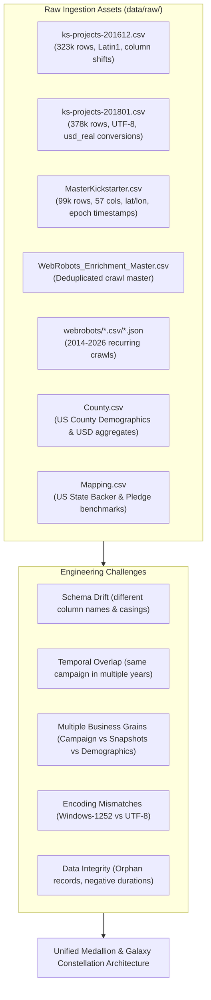

# 00 — Project Architecture & Setup Guide

## Kickstarter Analytics Engineering Platform

Welcome to the **Kickstarter Analytics Engineering Platform**. This document establishes the foundational architecture, developer environment, and governance standards for transitioning fragmented raw Kickstarter snapshots and continuous WebRobots crawls into a high-performance, enterprise-grade Power BI semantic model.

---

## 1. The Core Engineering Challenge

Unlike trivial BI projects that ingest a single clean CSV file, real-world analytics engineering requires tackling heterogeneous data assets with severe schema and temporal drift:



### The Analytical Objective
1. **Preserve Lineage**: Track every record back to its exact origin and scrape date.
2. **Harmonize Entities**: Map divergent column naming conventions to a canonical campaign schema.
3. **Isolate Grains**: Separate project master records from time-series snapshots and regional benchmarks.
4. **Govern the Semantic Layer**: Power BI report authors must query clean dimensions and centralized DAX measures without touching raw files or encountering many-to-many relationship traps.

---

## 2. Architectural Framework: Medallion Architecture

We adopt the **Medallion Architecture** (Bronze → Silver → Gold) within Power BI and Power Query M:

```mermaid
flowchart LR
    subgraph Bronze["Bronze Layer (Raw Staging)"]
        direction TB
        B1["Src_* Connectors<br/>(Pure connection, no transforms)"]
        B2["Stg_* Queries<br/>(Type-casting, cleanup, trimming)"]
        B3["Load Disabled (Enable Load = False)"]
    end

    subgraph Silver["Silver Layer (Conformed & Harmonized)"]
        direction TB
        S1["Conformed_Campaign<br/>(Canonical schema union)"]
        S2["Deduplication Engine<br/>(Recency & hierarchy sorting)"]
        S3["Surrogate Key Generation<br/>(Deterministic keys)"]
        S4["Load Disabled (Enable Load = False)"]
    end

    subgraph Gold["Gold Layer (Galaxy Schema & Semantic Model)"]
        direction TB
        G1["Conformed Dimensions<br/>(Dim_Project, Dim_Category, Dim_Location, Dim_Date, Dim_Status, Dim_Currency)"]
        G2["Granular Facts<br/>(Fact_Campaign, Fact_CampaignSnapshot)"]
        G3["Aggregate Facts<br/>(Fact_CityMetrics, Fact_StateMetrics, Fact_CountyMetrics)"]
        G4["_Measures (Centralized DAX Library)"]
        G5["Loaded to VertiPaq Engine (Enable Load = True)"]
    end

    Bronze --> Silver --> Gold
```



| Medallion Layer | Power Query Group | Power BI Load State | Responsibility |
| :--- | :--- | :--- | :--- |
| **Bronze** | `01_Sources`, `02_Staging` | `Enable Load = False` | Raw data connection, encoding resolution, null sanitization, epoch-to-datetime conversions. |
| **Silver** | `03_Conformed` | `Enable Load = False` | Cross-source appending, deduplication priority resolution, surrogate key creation. |
| **Gold** | `04_Dimensions`, `05_Facts` | `Enable Load = True` | Star/Galaxy dimensional model loaded into VertiPaq storage engine for fast querying. |
| **Semantic** | `_Measures` Table | In-Memory Model | DAX business logic, KPIs, Time Intelligence, and dynamic format strings. |
| **Audit** | `99_QA` | `Enable Load = False` | Assertion testing queries verifying zero duplicate keys and zero orphan relationships. |

---

## 3. Power BI Developer Mode (PBIP) & TMDL Configuration

To maintain modern analytics engineering and software engineering (SWE) best practices, this repository uses **Power BI Project (`.pbip`)** format with **Tabular Model Definition Language (TMDL)**.

### Why PBIP & TMDL?
- **Version Control**: Unlike opaque `.pbix` binary blobs, `.pbip` stores human-readable plain text files.
- **Git Diffs**: Every added DAX measure, renamed column, or M transformation generates a clean, readable Git diff.
- **Concurrent Development**: Multiple engineers can work on different TMDL table files without file corruption.
- **CI/CD Integration**: TMDL can be linted, scanned for best practices (e.g., using Tabular Editor CLI / Best Practice Analyzer), and deployed via automated pipelines.

### Folder Structure
```text
kickstarter-analytics-engineering/
├── .github/                      # CI/CD workflows, PR and issue templates
│   ├── workflows/
│   │   ├── ci.yml
│   │   └── data_validation.yml
│   ├── ISSUE_TEMPLATE/
│   └── pull_request_template.md
├── assets/                       # Branding logos, color palette, style guide
├── data/                         # Ignored by Git (Large Raw Data)
│   ├── metadata/                 # dataset_manifest.csv, schema_registry.csv
│   └── raw/                      # master_kickstarter/, kickstarter_projects/, webrobots/
├── docs/                         # Step-by-step engineering and modeling guides
│   ├── 00_project_architecture_and_setup.md
│   ├── 01_source_data_profiling_and_ingestion.md
│   ├── 02_power_query_staging_layer_bronze.md
│   ├── 03_power_query_conformed_layer_silver.md
│   ├── 04_dimensional_modeling_and_galaxy_schema_gold.md
│   ├── 05_dax_semantic_layer_and_measure_library.md
│   ├── 06_data_quality_testing_and_reconciliation.md
│   ├── 07_power_bi_visual_design_and_ux_playbook.md
│   └── 08_git_pbip_and_ci_cd_deployment_workflow.md
├── powerbi/                      # Power BI Developer Mode Project
│   ├── kickstarter_analytics.pbip
│   ├── kickstarter_analytics.Report/
│   └── kickstarter_analytics.SemanticModel/
│       ├── definition/
│       │   ├── expressions.tmdl  # All Power Query M formulas
│       │   ├── model.tmdl        # Model relationships & query groups
│       │   └── tables/           # Individual TMDL table definitions
├── src/                          # Python ingestion, preparation & testing scripts
│   ├── download_kickstarter_datasets.py
│   ├── extract_datasets_script.py
│   ├── prepare_raw_webrobots_data.py
│   ├── webrobots_enrichment_prep.py
│   ├── generate_metadata.py
│   └── data_profiler.py
├── .gitignore
├── ARCHITECTURE.md
├── CONTRIBUTING.md
├── DATA_DICTIONARY.md
├── LICENSE
├── README.md
└── requirements.txt
```

---

## 4. Power Query Workspace Grouping Standards

Inside the Power Query Editor, queries must be strictly organized into numerical groups to preserve visual lineage and execution clarity:

```text
📁 00_Parameters
   └── DataFolderPath                   (Text parameter pointing to data directory)

📁 01_Sources                           (Raw file connections | Enable Load = False)
   ├── Src_Kaggle_2016
   ├── Src_Kaggle_2018
   ├── Src_MasterKickstarter
   ├── Src_WebRobots_Latest
   ├── Src_County
   └── Src_Mapping

📁 02_Staging                           (Bronze cleansing | Enable Load = False)
   ├── Stg_Kaggle_2016
   ├── Stg_Kaggle_2018
   ├── Stg_MasterKickstarter
   ├── Stg_WebRobots
   ├── Stg_County
   └── Stg_Mapping

📁 03_Conformed                         (Silver harmonization | Enable Load = False)
   ├── Conformed_Campaign_AllSources
   ├── Conformed_Campaign_Deduplicated
   └── Conformed_Location_Master

📁 04_Dimensions                        (Gold conformed entities | Enable Load = True)
   ├── Dim_Project
   ├── Dim_Category
   ├── Dim_Location
   ├── Dim_Currency
   ├── Dim_Status
   └── Dim_Date                         (DAX-generated calendar table)

📁 05_Facts                             (Gold business facts | Enable Load = True)
   ├── Fact_Campaign                    (Granular campaign master: 1 row / project)
   ├── Fact_CampaignSnapshot            (WebRobots time-series: 1 row / project / scrape)
   ├── Fact_CityMetrics                 (City demographic & backer aggregates)
   ├── Fact_StateMetrics                (US State benchmarks)
   └── Fact_CountyMetrics               (US County benchmarks)

📁 99_QA                                (Quality audit queries | Enable Load = False)
   ├── QA_DuplicateProjectIDs
   ├── QA_OrphanLocationKeys
   ├── QA_NegativePledgedValues
   └── QA_DateInversionViolations
```

---

## 5. Setting Up the Dynamic Data Parameter

To ensure zero hardcoded paths so that any team member can clone the repository and run the project seamlessly:

### Power Query M Parameter Code
```powerquery
// Parameter: DataFolderPath
// Location: 00_Parameters
"D:\courses\Data Analysis 26-27\Projects\Kickstarter Projects\data\" meta [
    IsParameterQuery = true,
    IsParameterQueryRequired = true,
    Type = type text,
    Description = "Absolute path to the project root data directory containing raw/ and metadata/ subdirectories."
]
```

### Usage Rule
Every source connector references `DataFolderPath & "raw\..."`:
```powerquery
Source = Csv.Document(
    File.Contents(DataFolderPath & "raw\kickstarter_projects\ks-projects-201801.csv"),
    [Delimiter = ",", Columns = 15, Encoding = 65001, QuoteStyle = QuoteStyle.None]
)
```

---

## 6. Pre-Flight Checklist Before You Begin

Before opening Power BI Desktop or executing transformations, complete these pre-flight checks:

1. [x] **Python Environment**: Ensure Python 3.9+ is installed. Run `pip install -r requirements.txt`.
2. [x] **Data Folder Verification**: Verify that `data/raw/` contains the necessary CSV files. Run `python src/generate_metadata.py` to confirm file presence.
3. [x] **Power BI Desktop Options**:
   - In Power BI Desktop, navigate to **File > Options and settings > Options**.
   - Under **Global > Data Load**, disable **Auto detect new relationships after data is loaded** (relationships must be engineered manually).
   - Under **Current File > Data Load**, disable **Auto date/time** (ensures lean model size and enables custom date tables).
   - Under **Preview Features**, enable **Power BI Project (.pbip) save option** and **TMDL format**.
