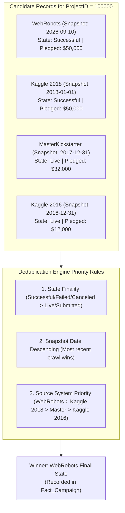

# 03 — Power Query Conformed Layer (Silver) Guide

## Building the Conformed Harmonization Layer (Silver)

The **Conformed Layer** (Silver) bridges the gap between individual, source-specific staging queries and the final dimensional model. 

In analytics engineering, building conformed entities solves two major problems:
1. **Preventing Grain Mixing**: Without conformed dimensions, project details, category names, and geographic statistics would remain mashed into giant fact tables, causing bloated storage and Cartesian joins.
2. **Deterministic Cross-Source Deduplication**: A campaign launched in late 2016 might appear in `Stg_Kaggle_2016`, `Stg_MasterKickstarter`, `Stg_Kaggle_2018`, and multiple `Stg_WebRobots` crawl snapshots. We must resolve which record wins canonical authority.

---

## 1. Deterministic Deduplication Hierarchy

When multiple sources contain the same `ProjectID`, which record should Power BI keep as the canonical master?



### Power Query Deduplication Engine Pattern:
```powerquery
// Sort by Snapshot_Date descending, then buffer memory, then take distinct
#"Sorted Recency" = Table.Sort(
    #"Appended Sources",
    {{"Snapshot_Date", Order.Descending}, {"PledgedUSD", Order.Descending}}
),
#"Buffered Table" = Table.Buffer(#"Sorted Recency"),
#"Deduplicated Master" = Table.Distinct(#"Buffered Table", {"ProjectID"})
```

> [!TIP]
> **Why `Table.Buffer` is Essential**: In Power Query M, `Table.Distinct` does not guarantee row order preservation across streaming partitions unless the sorted table is explicitly cached into memory using `Table.Buffer`.

---

## 2. Canonical Schema Definition

Before appending sources into `Conformed_Campaign`, we select and harmonize only the canonical columns:

| Canonical Column | Data Type | Description |
| :--- | :--- | :--- |
| `ProjectID` | `Int64.Type` | Natural Kickstarter unique identifier. |
| `ProjectName` | `type text` | Clean title of the project. |
| `Category` | `type text` | Top-level category (e.g., 'Games', 'Technology'). |
| `Subcategory` | `type text` | Granular subcategory (e.g., 'Tabletop Games', 'Web'). |
| `CurrencyCode` | `type text` | ISO 3-character currency code ('USD', 'GBP', 'EUR'). |
| `CountryCode` | `type text` | ISO 2-character country code ('US', 'GB', 'CA'). |
| `GoalUSD` | `Currency.Type` | Target funding normalized to USD. |
| `PledgedUSD` | `Currency.Type` | Actual pledged funds normalized to USD. |
| `BackerCount` | `Int64.Type` | Total unique funding backers. |
| `ProjectStatus` | `type text` | Final status ('Successful', 'Failed', 'Canceled', 'Live'). |
| `LaunchDate` | `type date` | Date the campaign went live. |
| `DeadlineDate` | `type date` | Funding cutoff date. |
| `CampaignDurationDays` | `Int64.Type` | Days between launch and deadline. |
| `Source_System` | `type text` | Origin source identifier for data lineage. |
| `Snapshot_Date` | `type date` | Date of data capture. |

---

## 3. Conformed Query Implementations (Group: `03_Conformed`)

### 1. `Conformed_Campaign_AllSources`
Appends all staging tables into a single raw observation pool.

```powerquery
let
    // 1. Select standardized columns from each staging table
    Cols = {
        "ProjectID", "ProjectName", "Subcategory", "Category", "CurrencyCode",
        "CountryCode", "GoalUSD", "PledgedUSD", "BackerCount", "ProjectStatus",
        "LaunchDate", "DeadlineDate", "CampaignDurationDays", "Source_System", "Snapshot_Date"
    },

    K16 = Table.SelectColumns(Stg_Kaggle_2016, Cols, MissingField.Ignore),
    K18 = Table.SelectColumns(Stg_Kaggle_2018, Cols, MissingField.Ignore),
    MK  = Table.SelectColumns(Stg_MasterKickstarter, Cols, MissingField.Ignore),
    WR  = Table.SelectColumns(Stg_WebRobots, Cols, MissingField.Ignore),

    // 2. Append all tables
    #"Appended All" = Table.Combine({WR, K18, MK, K16}),

    // 3. Filter out invalid null ProjectIDs
    #"Filtered Valid IDs" = Table.SelectRows(#"Appended All", each [ProjectID] <> null)
in
    #"Filtered Valid IDs"
```

---

### 2. `Conformed_Campaign_Deduplicated`
Applies deterministic recency and authority filtering to produce 1 row per unique project.

```powerquery
let
    Source = Conformed_Campaign_AllSources,

    // 1. Sort by recency and pledge amount descending
    #"Sorted Rows" = Table.Sort(
        Source,
        {
            {"Snapshot_Date", Order.Descending},
            {"PledgedUSD", Order.Descending}
        }
    ),

    // 2. Buffer in memory to guarantee sort order retention
    #"Buffered Table" = Table.Buffer(#"Sorted Rows"),

    // 3. Keep first occurrence per ProjectID
    #"Deduplicated Records" = Table.Distinct(#"Buffered Table", {"ProjectID"})
in
    #"Deduplicated Records"
```

---

### 3. Extracting Dimension Entities

By referencing `Conformed_Campaign_Deduplicated`, we isolate each business entity into an independent, conformed dimension table.

#### A. `Conformed_Category`
```powerquery
let
    Source = Conformed_Campaign_Deduplicated,
    #"Selected Columns" = Table.SelectColumns(Source, {"Category", "Subcategory"}),
    #"Distinct Rows" = Table.Distinct(#"Selected Columns"),
    #"Filtered Nulls" = Table.SelectRows(#"Distinct Rows", each [Category] <> null),
    #"Sorted" = Table.Sort(#"Filtered Nulls", {{"Category", Order.Ascending}, {"Subcategory", Order.Ascending}}),
    #"Added CategoryKey" = Table.AddIndexColumn(#"Sorted", "CategoryKey", 1, 1, Int64.Type)
in
    #"Added CategoryKey"
```

#### B. `Conformed_Currency`
```powerquery
let
    Source = Conformed_Campaign_Deduplicated,
    #"Selected Columns" = Table.SelectColumns(Source, {"CurrencyCode"}),
    #"Distinct Rows" = Table.Distinct(#"Selected Columns"),
    #"Filtered Nulls" = Table.SelectRows(#"Distinct Rows", each [CurrencyCode] <> null and [CurrencyCode] <> ""),
    #"Sorted" = Table.Sort(#"Filtered Nulls", {{"CurrencyCode", Order.Ascending}}),
    #"Added CurrencyKey" = Table.AddIndexColumn(#"Sorted", "CurrencyKey", 1, 1, Int64.Type),
    #"Added Currency Symbol" = Table.AddColumn(
        #"Added CurrencyKey",
        "CurrencySymbol",
        each if [CurrencyCode] = "USD" then "$"
             else if [CurrencyCode] = "GBP" then "£"
             else if [CurrencyCode] = "EUR" then "€"
             else if [CurrencyCode] = "CAD" then "CA$"
             else if [CurrencyCode] = "AUD" then "AU$"
             else [CurrencyCode],
        type text
    )
in
    #"Added Currency Symbol"
```

#### C. `Conformed_Status`
```powerquery
let
    Source = Conformed_Campaign_Deduplicated,
    #"Selected Columns" = Table.SelectColumns(Source, {"ProjectStatus"}),
    #"Distinct Rows" = Table.Distinct(#"Selected Columns"),
    #"Sorted" = Table.Sort(#"Distinct Rows", {{"ProjectStatus", Order.Ascending}}),
    #"Added StatusKey" = Table.AddIndexColumn(#"Sorted", "StatusKey", 1, 1, Int64.Type),
    #"Added IsCompleted" = Table.AddColumn(
        #"Added StatusKey",
        "IsCompleted",
        each if List.Contains({"Successful", "Failed", "Canceled", "Suspended"}, [ProjectStatus]) then 1 else 0,
        Int64.Type
    ),
    #"Added IsSuccessful" = Table.AddColumn(
        #"Added IsCompleted",
        "IsSuccessful",
        each if [ProjectStatus] = "Successful" then 1 else 0,
        Int64.Type
    ),
    #"Added StatusGroup" = Table.AddColumn(
        #"Added IsSuccessful",
        "StatusGroup",
        each if [ProjectStatus] = "Successful" then "Funded"
             else if [ProjectStatus] = "Live" then "In Progress"
             else "Unfunded",
        type text
    )
in
    #"Added StatusGroup"
```

#### D. `Conformed_Location`
Derived from `Stg_MasterKickstarter` which contains coordinates and full city/state metadata, unioned with distinct country codes from Kaggle.

```powerquery
let
    // 1. Extract detailed locations from MasterKickstarter
    SourceMaster = Table.SelectColumns(
        Stg_MasterKickstarter,
        {"CountryName", "State", "County", "City", "Latitude", "Longitude"},
        MissingField.Ignore
    ),
    #"Distinct Master" = Table.Distinct(SourceMaster),

    // 2. Add LocationKey
    #"Sorted" = Table.Sort(#"Distinct Master", {{"CountryName", Order.Ascending}, {"State", Order.Ascending}, {"City", Order.Ascending}}),
    #"Added LocationKey" = Table.AddIndexColumn(#"Sorted", "LocationKey", 1, 1, Int64.Type)
in
    #"Added LocationKey"
```

---

## 4. Surrogate Key Strategy

In high-performance Power BI Tabular models, **always join on compact integer surrogate keys (`Int64.Type`)** rather than composite or wide text strings:
- Reduces VertiPaq memory footprint by up to 70%.
- Maximizes relationship lookup throughput during DAX calculation execution.
- Prevents casing and collation mismatch bugs between data sources.
