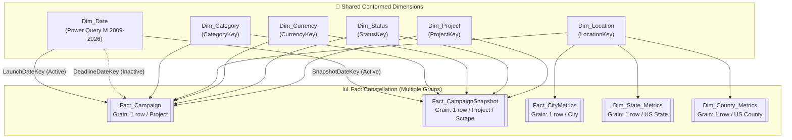

# 04 — Dimensional Modeling & Galaxy Schema (Gold) Guide

## Galaxy Schema (Fact Constellation) Design Blueprint

The **Gold Layer** is the final, user-facing analytical model loaded into Power BI's in-memory columnar database (VertiPaq). In this layer, queries switch from `Enable Load = False` to **`Enable Load = True`**.

---

## 1. Why a Single Star Schema is Insufficient

A conventional Star Schema centers around a single Fact table. However, our Kickstarter dataset spans multiple distinct business entities and grains:

1. **Static Campaign Master**: One row per unique campaign, capturing final outcome and total raised.
2. **Longitudinal Crawl Snapshots**: Multiple observations per campaign across WebRobots monthly crawls (2014–2026), capturing funding progression.
3. **Geographic Demographics & Benchmarks**: Aggregate metrics per City, US County (`County.csv`), and US State (`Mapping.csv`).

If an analytics engineer attempts to cram city population and county statistics into `Fact_Campaign`, any visual that slices by Category will multiply county population numbers by thousands of campaigns, corrupting aggregations.

### The Solution: Galaxy Schema (Fact Constellation)
We implement a **Galaxy Schema**, where multiple Fact tables share a unified suite of **Conformed Dimensions**:



---

## 2. Table Grains & Schema Specifications

### Conformed Dimensions

#### 1. `Dim_Project`
- **Grain**: 1 row per unique Kickstarter project.
- **Attributes**: `ProjectKey` (PK, Int64), `ProjectID` (Natural Key, Int64), `ProjectName`, `ProjectSlug`, `Blurb`, `Source_System`.

#### 2. `Dim_Category`
- **Grain**: 1 row per Category + Subcategory combination.
- **Attributes**: `CategoryKey` (PK, Int64), `Category`, `Subcategory`.

#### 3. `Dim_Location`
- **Grain**: 1 row per unique City + State + Country combination.
- **Attributes**: `LocationKey` (PK, Int64), `CountryCode`, `CountryName`, `State`, `County`, `City`, `Latitude`, `Longitude`.

#### 4. `Dim_Currency`
- **Grain**: 1 row per ISO currency code.
- **Attributes**: `CurrencyKey` (PK, Int64), `CurrencyCode`, `CurrencySymbol`.

#### 5. `Dim_Status`
- **Grain**: 1 row per campaign state.
- **Attributes**: `StatusKey` (PK, Int64), `ProjectStatus`, `StatusGroup` ('Funded', 'In Progress', 'Unfunded'), `IsCompleted` (1/0), `IsSuccessful` (1/0).

#### 6. `Dim_Date` (Power Query M — Generated)
- **Grain**: 1 row per calendar day from Jan 1, 2009 to Dec 31, 2026.
- **Attributes**: `DateKey` (PK, `YYYYMMDD`, Int64), `Date`, `Year`, `MonthNumber`, `MonthName`, `MonthShort`, `YearMonth`, `QuarterNumber`, `Quarter`, `YearQuarter`, `DayOfMonth`, `DayOfWeekNumber`, `DayName`, `DayShort`, `IsWeekend`.

---

### Fact Tables

#### 1. `Fact_Campaign` (Core Fact)
- **Grain**: 1 row per unique project (Canonical portfolio record).
- **Foreign Keys**:
  - `ProjectKey` → `Dim_Project[ProjectKey]`
  - `CategoryKey` → `Dim_Category[CategoryKey]`
  - `LocationKey` → `Dim_Location[LocationKey]`
  - `CurrencyKey` → `Dim_Currency[CurrencyKey]`
  - `StatusKey` → `Dim_Status[StatusKey]`
  - `LaunchDateKey` → `Dim_Date[DateKey]` (Active)
  - `DeadlineDateKey` → `Dim_Date[DateKey]` (Inactive)
- **Measures / Metrics**: `GoalUSD`, `PledgedUSD`, `GoalLocal`, `PledgedLocal`, `BackerCount`, `CampaignDurationDays`, `GoalAchievementPct`, `PledgePerBacker`.

#### 2. `Fact_CampaignSnapshot` (Longitudinal Fact)
- **Grain**: 1 row per project per WebRobots crawl snapshot.
- **Foreign Keys**: `ProjectKey`, `CategoryKey`, `CurrencyKey`, `StatusKey`, `SnapshotDateKey` → `Dim_Date[DateKey]`.
- **Measures / Metrics**: `GoalUSD`, `PledgedUSD`, `BackerCount`.

#### 3. `Fact_CityMetrics`
- **Grain**: 1 row per city.
- **Attributes / Metrics**: `LocationKey`, `CityPopulation`, `CityAllTimeBackers`, `MeanPledgeCity`.

#### 4. `Dim_State_Metrics` & `Dim_County_Metrics`
- Loaded from `Mapping.csv` and `County.csv` providing regional benchmark baselines.

---

## 3. Creating the Enterprise `Dim_Date` Table in Power Query (M Language)

> [!IMPORTANT]
> `Dim_Date` is built entirely in **Power Query using M language** — NOT with DAX `CALENDAR()`. This approach runs at query-fold time (before VertiPaq compression), keeps the data lineage visible in the Power Query Editor GUI, and avoids the hidden DAX table overhead. Disable the Power BI auto-date/time setting: **File → Options → Data Load → uncheck "Auto date/time"**.

### Step-by-Step: Create `Dim_Date` via Advanced Editor (Power Query GUI)

#### Step 1 — Open Power Query Editor
In Power BI Desktop: **Home → Transform Data → Transform Data**.

#### Step 2 — Create a New Blank Query
In Power Query Editor: **Home → New Source → Blank Query**.

#### Step 3 — Open Advanced Editor
Right-click the new query in the Queries pane → **Advanced Editor** (or **Home → Advanced Editor**).

#### Step 4 — Paste the Full M Code

Replace all existing text with the following M language script:

```m
let
    // ── Parameters ──────────────────────────────────────────────────
    StartDate = #date(2009, 1, 1),
    EndDate   = #date(2026, 12, 31),

    // ── Generate list of days ────────────────────────────────────────
    DayCount      = Duration.Days(EndDate - StartDate) + 1,
    DateList      = List.Dates(StartDate, DayCount, #duration(1, 0, 0, 0)),
    DateTable     = Table.FromList(DateList, Splitter.SplitByNothing(), {"Date"}),

    // ── Cast Date column to proper Date type ─────────────────────────
    TypedDate = Table.TransformColumnTypes(DateTable, {{"Date", type date}}),

    // ── DateKey (YYYYMMDD integer) ────────────────────────────────────
    AddDateKey = Table.AddColumn(TypedDate, "DateKey",
        each Date.Year([Date]) * 10000
            + Date.Month([Date]) * 100
            + Date.Day([Date]),
        Int64.Type),

    // ── Year ──────────────────────────────────────────────────────────
    AddYear = Table.AddColumn(AddDateKey, "Year",
        each Date.Year([Date]), Int64.Type),

    // ── Month Number ──────────────────────────────────────────────────
    AddMonthNumber = Table.AddColumn(AddYear, "MonthNumber",
        each Date.Month([Date]), Int64.Type),

    // ── Month Name (locale-aware full name) ───────────────────────────
    AddMonthName = Table.AddColumn(AddMonthNumber, "MonthName",
        each Date.MonthName([Date]), type text),

    // ── Month Short (3-letter abbreviation) ───────────────────────────
    AddMonthShort = Table.AddColumn(AddMonthName, "MonthShort",
        each Text.Start(Date.MonthName([Date]), 3), type text),

    // ── Year-Month label (e.g. "2024-03") ────────────────────────────
    AddYearMonth = Table.AddColumn(AddMonthShort, "YearMonth",
        each Text.PadStart(Text.From(Date.Year([Date])), 4, "0")
            & "-"
            & Text.PadStart(Text.From(Date.Month([Date])), 2, "0"),
        type text),

    // ── Quarter Number ────────────────────────────────────────────────
    AddQuarterNumber = Table.AddColumn(AddYearMonth, "QuarterNumber",
        each Date.QuarterOfYear([Date]), Int64.Type),

    // ── Quarter Label (e.g. "Q2") ─────────────────────────────────────
    AddQuarter = Table.AddColumn(AddQuarterNumber, "Quarter",
        each "Q" & Text.From(Date.QuarterOfYear([Date])), type text),

    // ── Year-Quarter label (e.g. "2024 Q2") ──────────────────────────
    AddYearQuarter = Table.AddColumn(AddQuarter, "YearQuarter",
        each Text.From(Date.Year([Date]))
            & " Q"
            & Text.From(Date.QuarterOfYear([Date])),
        type text),

    // ── Day of Month ──────────────────────────────────────────────────
    AddDayOfMonth = Table.AddColumn(AddYearQuarter, "DayOfMonth",
        each Date.Day([Date]), Int64.Type),

    // ── Day of Week Number (1=Monday … 7=Sunday, ISO 8601) ────────────
    AddDayOfWeekNumber = Table.AddColumn(AddDayOfMonth, "DayOfWeekNumber",
        each
            let d = Date.DayOfWeek([Date], Day.Monday) + 1
            in d,
        Int64.Type),

    // ── Day Name (full locale-aware name) ────────────────────────────
    AddDayName = Table.AddColumn(AddDayOfWeekNumber, "DayName",
        each Date.DayOfWeekName([Date]), type text),

    // ── Day Short (3-letter abbreviation) ────────────────────────────
    AddDayShort = Table.AddColumn(AddDayName, "DayShort",
        each Text.Start(Date.DayOfWeekName([Date]), 3), type text),

    // ── IsWeekend flag (1 = Weekend, 0 = Weekday) ────────────────────
    AddIsWeekend = Table.AddColumn(AddDayShort, "IsWeekend",
        each if Date.DayOfWeek([Date], Day.Monday) >= 5 then 1 else 0,
        Int64.Type),

    // ── Final column ordering & types ────────────────────────────────
    ReorderCols = Table.ReorderColumns(AddIsWeekend, {
        "DateKey", "Date", "Year", "MonthNumber", "MonthName",
        "MonthShort", "YearMonth", "QuarterNumber", "Quarter",
        "YearQuarter", "DayOfMonth", "DayOfWeekNumber", "DayName",
        "DayShort", "IsWeekend"
    })

in
    ReorderCols
```

#### Step 5 — Rename the Query
In the **Query Settings** panel on the right, rename the query from `Query1` to **`Dim_Date`**.

#### Step 6 — Set "Enable Load" to True
Right-click `Dim_Date` in the Queries pane → **Enable Load** (ensure it is checked ✅). This is the only dimension that gets loaded into VertiPaq directly from Power Query rather than being referenced from another query.

#### Step 7 — Close & Apply
Click **Home → Close & Apply** to load `Dim_Date` into the model.

---

### Power Query GUI Column Configuration (After Loading)

In **Power BI Model View**, apply these mandatory sort-by rules:

"| Column | Sort By Column |
| :--- | :--- |
| `MonthName` | `MonthNumber` |
| `MonthShort` | `MonthNumber` |
| `Quarter` | `QuarterNumber` |
| `YearQuarter` | `DateKey` |
| `DayName` | `DayOfWeekNumber` |
| `DayShort` | `DayOfWeekNumber` |"

### Mark as Date Table
Right-click `Dim_Date` in Model View → **Mark as date table** → Select `[Date]` as the date column. This enables native Time Intelligence (e.g., `SAMEPERIODLASTYEAR`, `TOTALYTD`) to work correctly.

> [!TIP]
> **Why M over DAX for `Dim_Date`?**
> - M runs during **query evaluation** (before model load), reducing VertiPaq refresh time.
> - Columns are visible and editable in the **Power Query Editor GUI** — no hidden computed tables.
> - Locale-aware functions (`Date.MonthName`, `Date.DayOfWeekName`) respect regional settings.
> - `DateKey` is computed as a pure integer arithmetic expression — no `FORMAT()` overhead.
> - The query is **fully foldable** against a database source if you later migrate to DirectQuery or Dataflow Gen2.

---

## 4. Relationship Architecture & Cardinality Rules

In Power BI Model View, configure relationships adhering strictly to Kimball enterprise standards:

"| From Table (Fact) | Foreign Key |" To Table (Dim) "| Primary Key | Cardinality | Cross Filter | Active State |
| :--- | :--- | :--- | :--- | :--- | :--- | :--- |
| `Fact_Campaign` | `ProjectKey` | `Dim_Project` | `ProjectKey` |" Many-to-One (*:1) "| Single | **Active** |
| `Fact_Campaign` | `CategoryKey` | `Dim_Category` | `CategoryKey` |" Many-to-One (*:1) "| Single | **Active** |
| `Fact_Campaign` | `LocationKey` | `Dim_Location` | `LocationKey` |" Many-to-One (*:1) "| Single | **Active** |
| `Fact_Campaign` | `CurrencyKey` | `Dim_Currency` | `CurrencyKey` |" Many-to-One (*:1) "| Single | **Active** |
| `Fact_Campaign` | `StatusKey` | `Dim_Status` | `StatusKey` |" Many-to-One (*:1) "| Single | **Active** |
| `Fact_Campaign` | `LaunchDateKey` | `Dim_Date` | `DateKey` |" Many-to-One (*:1) "| Single | **Active** |
| `Fact_Campaign` | `DeadlineDateKey`| `Dim_Date` | `DateKey` |" Many-to-One (*:1) "| Single | **Inactive** |
| `Fact_CampaignSnapshot` | `ProjectKey` | `Dim_Project` | `ProjectKey` |" Many-to-One (*:1) "| Single | **Active** |
| `Fact_CampaignSnapshot` | `CategoryKey`| `Dim_Category` | `CategoryKey` |" Many-to-One (*:1) "| Single | **Active** |
| `Fact_CampaignSnapshot` | `SnapshotDateKey` | `Dim_Date` | `DateKey` |" Many-to-One (*:1) "| Single | **Active** |

> [!CAUTION]
> **Strict Modeling Commandments**:
> 1. **Never use Bi-Directional filtering** (`Both`). It causes ambiguous filter paths and severe performance degradation.
> 2. **Never create Fact-to-Fact relationships**. `Fact_Campaign` and `Fact_CampaignSnapshot` must communicate exclusively through shared dimensions (`Dim_Project`, `Dim_Category`, `Dim_Date`).
> 3. **Hide All Surrogate Keys**: Right-click every foreign key column (`*Key`) in Fact tables and select **Hide in report view**. End users should only filter using descriptive text fields in Dimension tables.
