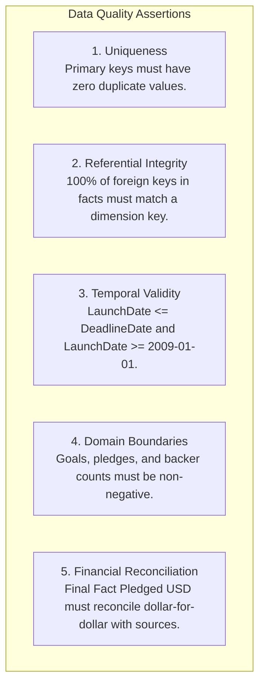

# 06 — Data Quality Testing & Reconciliation Guide

## Enterprise Data Quality (DQ) & Assertion Framework

A hallmark of a true **Analytics Engineering Mindset** is never trusting data blindly. Just as software engineers write unit and integration tests, analytics engineers build automated assertions to guarantee that data moving through Bronze → Silver → Gold adheres to business rules and mathematical invariants.

---

## 1. The 5 Core Data Quality Dimensions



---

## 2. Power Query M Diagnostic Queries (Group: `99_QA`)

Inside the Power Query Editor, create diagnostic queries in group `99_QA`.
**Assertion Rule**: If your pipeline is functioning correctly, every single QA query below must return **exactly zero rows**.

### 1. `QA_DuplicateProjectIDs`
Verifies that the deduplication engine in `Fact_Campaign` achieved true 1:1 primary key uniqueness.

```powerquery
let
    Source = Fact_Campaign,
    #"Grouped Rows" = Table.Group(
        Source,
        {"ProjectKey"},
        {{"RowCount", each Table.RowCount(_), Int64.Type}}
    ),
    #"Filtered Duplicates" = Table.SelectRows(#"Grouped Rows", each [RowCount] > 1)
in
    #"Filtered Duplicates"
```
*Expected Result: 0 rows. Any row returned indicates a failure in deduplication buffering.*

---

### 2. `QA_OrphanCategoryKeys`
Performs an anti-join to detect any campaign whose `CategoryKey` does not exist in `Dim_Category`.

```powerquery
let
    Facts = Table.SelectColumns(Fact_Campaign, {"ProjectKey", "CategoryKey"}),
    Dims = Table.SelectColumns(Dim_Category, {"CategoryKey"}),
    #"Joined Anti" = Table.NestedJoin(
        Facts, {"CategoryKey"},
        Dims, {"CategoryKey"},
        "MatchedDim",
        JoinKind.LeftAnti
    )
in
    #"Joined Anti"
```
*Expected Result: 0 rows. Any row indicates missing dimension members.*

---

### 3. `QA_NegativeFinancialValues`
Verifies that no corrupt negative currencies or negative backer counts infiltrated the model.

```powerquery
let
    Source = Fact_Campaign,
    #"Filtered Violations" = Table.SelectRows(
        Source,
        each [PledgedUSD] < 0 or [GoalUSD] < 0 or [BackerCount] < 0
    ),
    #"Selected Violations" = Table.SelectColumns(
        #"Filtered Violations",
        {"ProjectKey", "GoalUSD", "PledgedUSD", "BackerCount"}
    )
in
    #"Selected Violations"
```
*Expected Result: 0 rows.*

---

### 4. `QA_DateInversionViolations`
Catches temporal impossibilities (e.g., campaigns that completed before they launched).

```powerquery
let
    Source = Fact_Campaign,
    #"Filtered Inversions" = Table.SelectRows(
        Source,
        each [CampaignDurationDays] < 0 or [CampaignDurationDays] > 365
    ),
    #"Selected Inversions" = Table.SelectColumns(
        #"Filtered Inversions",
        {"ProjectKey", "LaunchDateKey", "DeadlineDateKey", "CampaignDurationDays"}
    )
in
    #"Selected Inversions"
```
*Expected Result: 0 rows. (Kickstarter enforces a maximum campaign duration of 60 days; any value over 365 indicates corrupted epoch timestamps).*

---

### 5. `QA_ReconciliationAudit`
Performs cross-layer financial reconciliation to ensure no dollars were accidentally dropped during deduplication.

```powerquery
let
    RawPledged = List.Sum(Conformed_Campaign_AllSources[PledgedUSD]),
    DedupPledged = List.Sum(Fact_Campaign[PledgedUSD]),
    Difference = RawPledged - DedupPledged,
    Result = #table(
        {"Metric", "Value"},
        {
            {"Raw Total Appended Pledged USD", RawPledged},
            {"Deduplicated Fact Pledged USD", DedupPledged},
            {"Deduplication Variance (Expected due to multi-scrape deduplication)", Difference}
        }
    )
in
    Result
```

---

## 3. DAX Audit & Health Measures

Build automated status card measures to monitor model integrity on a hidden "Data Health" report page:

```dax
// Measure: Audit Orphan Location Count
Audit Orphan Location Count = 
COUNTROWS(
    FILTER(
        Fact_Campaign,
        ISBLANK(RELATED(Dim_Location[LocationKey]))
    )
)
```

```dax
// Measure: Audit Orphan Category Count
Audit Orphan Category Count = 
COUNTROWS(
    FILTER(
        Fact_Campaign,
        ISBLANK(RELATED(Dim_Category[CategoryKey]))
    )
)
```

```dax
// Measure: Audit Model Health Status
Audit Model Health Status = 
VAR Orphans = [Audit Orphan Location Count] + [Audit Orphan Category Count]
RETURN
IF(
    Orphans = 0,
    "✅ PASSED: Model Integrity 100%",
    "⚠️ FAILED: " & Orphans & " Orphan Foreign Keys Detected"
)
```

---

## 4. Automated Python Validation Suite

You can execute automated pre-commit testing using Python to validate all CSV files in `data/raw/` before opening Power BI:

```bash
python src/data_profiler.py
```
This script audits:
- Row counts and distinct `ProjectID` cardinality.
- Missing value percentages across all 57 columns.
- Minimum and maximum date ranges.
- Confirms zero corrupt rows in CSV headers.
