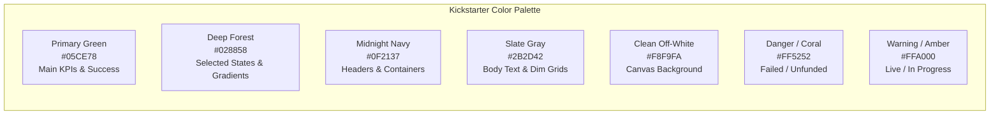

# 07 — Power BI Visual Design & UX Playbook

## Visual Design, User Experience & Dashboard Architecture

An analytical model is only as effective as its end-user experience. This playbook establishes enterprise Power BI design standards, incorporating **Kickstarter brand assets**, modern visual hierarchies, accessible color palettes, and structured report navigation.

---

## 1. Kickstarter Brand System & Color Tokens



### Color Token Reference Table
| Role | Color Name | Hex Code | Usage |
| :--- | :--- | :--- | :--- |
| **Primary Accent** | Kickstarter Green | `#05CE78` | Key cards, positive variances, successful campaign bars. |
| **Secondary Accent**| Deep Forest | `#028858` | Dark chart accents, hover highlights, table headers. |
| **Header Surface** | Midnight Navy | `#0F2137` | Navigation banners, card header backgrounds. |
| **Canvas** | Soft Gray | `#F8F9FA` | Main page canvas background (prevents harsh eye fatigue). |
| **Card Surface** | Pure White | `#FFFFFF` | Individual card containers with soft shadow (`#000000` 5% opacity). |
| **Text Primary** | Dark Slate | `#2B2D42` | Primary labels, numbers, visual titles. |
| **Text Muted** | Neutral Gray | `#6C757D` | Axis labels, subtitles, microcopy. |
| **State: Failed** | Signal Coral | `#FF5252` | Failed / canceled project bars, negative variances. |
| **State: Live** | Alert Amber | `#FFA000` | Currently active campaigns, in-progress funding bars. |

---

## 2. 5-Page Dashboard Architecture

A high-impact enterprise dashboard guides executive and operational users through a progressive narrative:

```text
📄 Page 1: Portfolio Executive Overview       (Macro health, portfolio growth, top categories)
📄 Page 2: Campaign Anatomy & Drivers         (Goal sizing, duration impact, staff pick influence)
📄 Page 3: Geographic Intelligence            (US maps, state benchmarks, city demographics)
📄 Page 4: Longitudinal Trajectory (WebRobots) (Monthly crawl progression, MoM momentum)
📄 Page 5: Governance & Data Quality          (Developer view: row counts, deduplication, DQ audit)
```

---

### Page 1: Portfolio Executive Overview
**Analytical Purpose**: Answer macro-level questions about platform health and long-term volume.

- **Top KPI Banner (4 Cards across top)**:
  1. `[Total Projects]` (with YoY % subtitle).
  2. `[Total Pledged USD]` (formatted `$#,##0,,.0 M`).
  3. `[Completed Success Rate %]` (with green gauge threshold at 40%).
  4. `[Total Backers]` (formatted `#,##0,,.0 M`).
- **Main Visual (Left 60%)**: Line & Clustered Column Chart:
  - X-Axis: `Dim_Date[Year]`.
  - Column Y-Axis: `[Total Projects]`.
  - Line Y-Axis: `[Total Pledged USD]`.
- **Category Matrix (Right 40%)**: Horizontal Bar Chart:
  - Y-Axis: `Dim_Category[Category]`.
  - X-Axis: `[Total Pledged USD]` sorted descending.
  - Data labels enabled.
- **Top Filters Bar**: Year slicer (dropdown), Category slicer (tile buttons).

---

### Page 2: Campaign Anatomy & Drivers
**Analytical Purpose**: Uncover what separates funded projects from failed attempts.

- **Scatter Plot (Center Stage)**:
  - X-Axis: `Fact_Campaign[GoalUSD]` (Logarithmic scale).
  - Y-Axis: `Fact_Campaign[PledgedUSD]` (Logarithmic scale).
  - Details: `Dim_Project[ProjectName]`.
  - Legend: `Dim_Status[ProjectStatus]`.
  - Constant Line: 45-degree angle line (`Y = X`) showing the break-even threshold.
- **Duration Analysis (Bottom Left)**: Column Chart:
  - X-Axis: Duration Bins (1-15 days, 16-30 days, 31-45 days, 46-60 days).
  - Y-Axis: `[Completed Success Rate %]`.
  - *Key Insight: Highlights why 30-day campaigns outperform 60-day campaigns.*
- **Staff Pick Impact (Bottom Right)**: 100% Stacked Bar Chart:
  - Category: `StaffPickFlag` (True vs False).
  - Values: `[Successful Projects]`, `[Failed Projects]`.

---

### Page 3: Geographic Intelligence & US Benchmarking
**Analytical Purpose**: Evaluate localized funding density and state-level benchmarking.

- **Choropleth Map (Left 60%)**:
  - Location: `Dim_Location[State]`.
  - Color Saturation: `[Total Pledged USD]`.
  - Tooltips: `[Total Projects]`, `[State Success Rate %]`, `[State Benchmark Mean USD]`.
- **Top Cities Table (Right 40%)**:
  - Columns: `City`, `State`, `City Population`, `[Total Backers]`, `[City Backer Penetration %]`.
- **State Benchmark Variance Card**:
  - Variance between campaign actuals and `Mapping.csv` state averages.

---

### Page 4: Longitudinal Trajectory (WebRobots Crawls)
**Analytical Purpose**: Leverage recurring WebRobots crawls (2014–2026) to analyze ongoing campaign funding velocity.

- **Area Chart**:
  - X-Axis: `Dim_Date[YearMonth]`.
  - Y-Axis: `[Snapshot Pledged USD]`.
- **MoM Momentum Bar Chart**:
  - X-Axis: `Dim_Date[YearMonth]`.
  - Y-Axis: `[Pledged Growth %]`.
  - Conditional formatting: Positive = Green (`#05CE78`), Negative = Coral (`#FF5252`).

---

### Page 5: Governance & Model Health (Developer View)
**Analytical Purpose**: Transparency and trust for audit committees and engineering teams.

- **Audit Status Cards**:
  - `[Audit Model Health Status]` (Large indicator banner).
  - `[Audit Orphan Location Count]`.
  - `[Audit Orphan Category Count]`.
- **Lineage Breakdown Table**:
  - Columns: `Source_System`, `Total Records Ingested`, `Distinct Projects`, `Total Pledged USD`.

---

## 3. Advanced Power BI UX Features

### 1. Slide-Out Filter Pane (Bookmarks)
To avoid cluttering the visual canvas:
- Create a collapsed filter icon button in the top right.
- Use **Bookmarks** and **Selection Pane** to toggle the visibility of an overlay container housing multi-select slicers (Category, Country, Year, Status).

### 2. Report Page Tooltips
Instead of generic black text tooltips:
1. Create a dedicated tooltip page (Canvas settings: Tooltip, 320px × 240px).
2. Add a mini sparkline chart showing monthly pledge velocity.
3. Link the tooltip page to the Category bar chart on Page 1.

### 3. Drill-Through Action
Allow business users to right-click any category bar (e.g., *Tabletop Games*) and drill through to a dedicated **Campaign Detail Page** filtered to that category, showcasing individual project names, blurbs, and backer counts.
