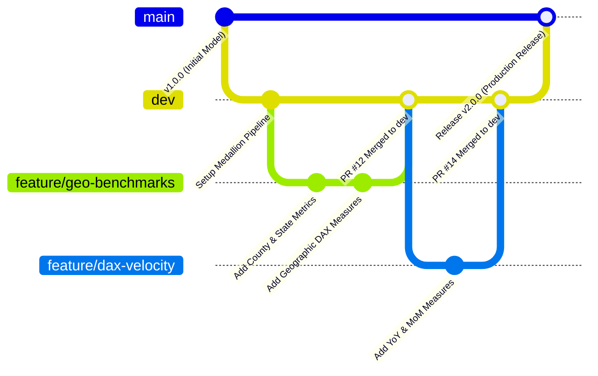

# 08 — Git, PBIP & CI/CD Deployment Workflow Guide

## Modern Analytics Engineering: Version Control & CI/CD for Power BI

Historically, Business Intelligence workflows suffered from binary file lock-in (`.pbix`). Two developers could not collaborate on the same data model without overwriting each other's work.

With **Power BI Developer Mode (`.pbip`)** and **Tabular Model Definition Language (TMDL)**, Power BI projects can now be managed with the same rigorous software engineering and CI/CD discipline as Python or dbt pipelines.

---

## 1. PBIP & TMDL Repository Architecture

When saved as a Power BI Project (`.pbip`), your solution decomposes into two core directories:

```text
powerbi/
├── kickstarter_analytics.pbip                     # Visual Studio / PBIDESKTOP pointer
│
├── kickstarter_analytics.Report/                  # Visual & Canvas Layer
│   ├── definition.pbir                           # Report binding reference
│   ├── definition/
│   │   ├── pages/                                # Individual JSON definitions per canvas page
│   │   │   └── page.json
│   │   ├── report.json                           # Report canvas theme, palette & global settings
│   │   └── bookmarks/                            # Saved bookmark states
│   └── StaticResources/                          # Embedded icons & custom visuals
│
└── kickstarter_analytics.SemanticModel/           # Semantic Model & TMDL Layer
    ├── definition.pbism                          # Semantic model configuration
    ├── diagramLayout.json                        # Visual diagram coordinates
    └── definition/
        ├── model.tmdl                            # Model culture, annotations & query groups
        ├── expressions.tmdl                      # All Power Query M code
        ├── database.tmdl                         # Database compatibility level
        └── tables/                               # 1 TMDL file per loaded table
            ├── Dim_Project.tmdl
            ├── Dim_Category.tmdl
            ├── Dim_Location.tmdl
            ├── Dim_Date.tmdl
            ├── Fact_Campaign.tmdl
            └── _Measures.tmdl                    # All centralized DAX measures
```

### Why TMDL Matters for Code Reviews
When a developer adds a new DAX measure in TMDL, the Git diff looks like this:

```diff
+ table _Measures
+   measure 'Completed Success Rate %' = 
+       DIVIDE([Successful Projects], [Completed Projects], 0)
+       formatString: 0.0%
+       displayFolder: 02 Success & Velocity Rates
+       lineageTag: a4b1c2d3-e4f5-6789-0123-abcdef456789
```
Code reviewers can review business logic directly on GitHub without opening Power BI Desktop.

---

## 2. Git Branching Strategy

We enforce the **GitHub Flow** branching model tailored for BI teams:



### Rules:
1. **`main`**: Protected branch. Represents the production semantic model currently deployed to the Power BI Service Production Workspace. Direct commits are blocked.
2. **`dev`**: Integration branch for staging testing.
3. **`feature/<feature-name>`**: Short-lived branches created by individual engineers for specific tasks (e.g., `feature/add-time-intelligence`).

---

## 3. Pull Request (PR) Quality Standards

Before any PR can be merged into `dev` or `main`, the author must verify the **Analytics Engineering PR Checklist**:

- [ ] **Data Lineage**: All new sources have `Enable Load = False` in `01_Sources` and `02_Staging`.
- [ ] **Data Types**: All numeric fields have explicit types (`Currency.Type` or `Int64.Type`).
- [ ] **Surrogate Keys**: Foreign key relationships join on integer keys (`*Key`), not raw text strings.
- [ ] **DAX Safety**: All divisions use `DIVIDE()`. Zero hardcoded `/` characters.
- [ ] **Key Hiding**: All surrogate foreign key columns in Fact tables are hidden in Report view.
- [ ] **QA Assertions**: All queries in `99_QA` return zero rows.
- [ ] **TMDL Formatting**: Code is formatted cleanly with consistent indentation.

---

## 4. Power BI Service Deployment Pipelines

For enterprise teams deploying to Microsoft Fabric / Power BI Service:


### Parameter Management across Environments
Use Power BI Deployment Pipeline parameter rules to automatically adjust `DataFolderPath` between local test drives and cloud Azure Data Lake Storage (ADLS Gen2) containers:
- **Dev**: Points to local mock dataset or Dev storage bucket.
- **Test**: Points to full staging lakehouse.
- **Prod**: Points to production lakehouse with scheduled incremental refresh.
