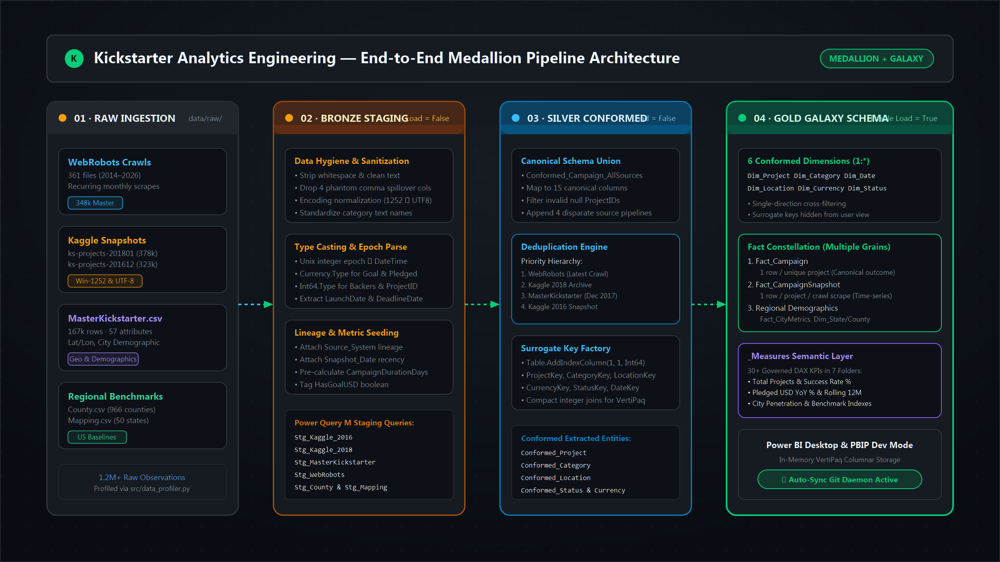
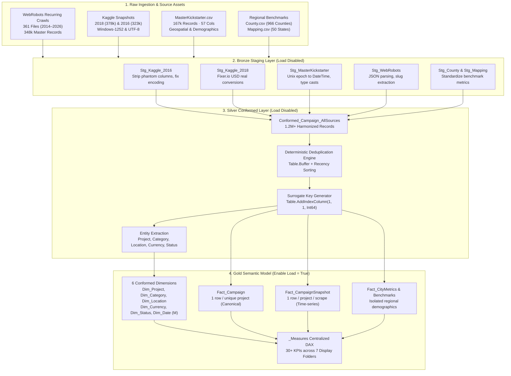
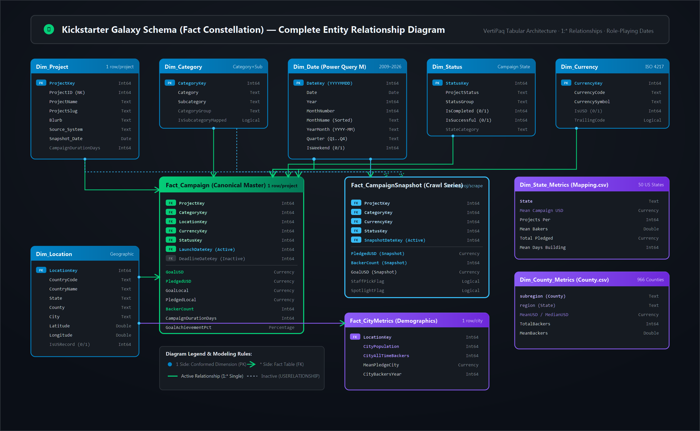
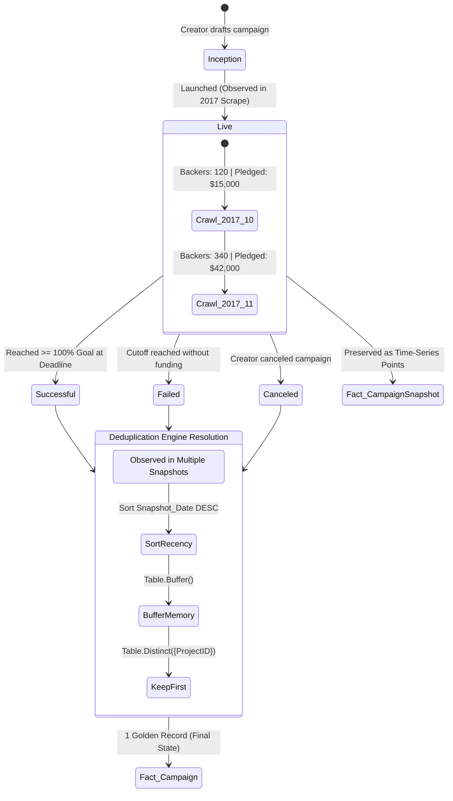
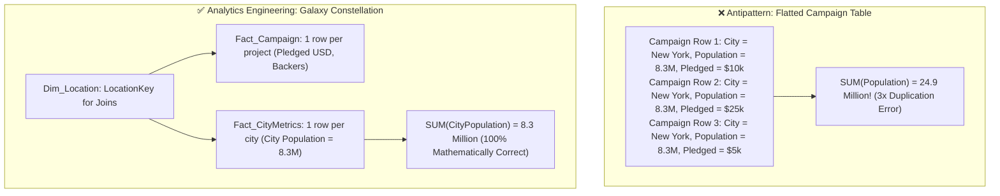
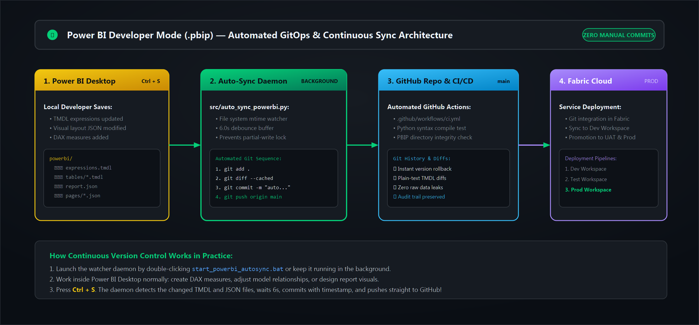
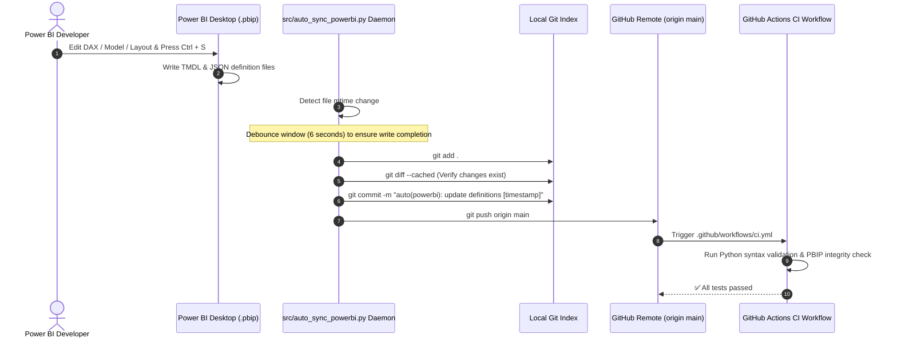

# 09 — System Architecture & Data Engineering Diagrams

## Visual Architecture Blueprint: Data Engineering & Power BI Modeling

This document provides a comprehensive visual and technical breakdown of the **Kickstarter Analytics Engineering Platform**. Designed from an enterprise Data Engineering mindset, these diagrams illustrate how raw, fragmented web scrapes and historical snapshots are transformed into a governed, scalable Power BI semantic model.

---

## 1. End-to-End Medallion Lakehouse Pipeline Architecture

The platform applies the **Medallion Architecture (Bronze → Silver → Gold)** to decouple raw data ingestion from analytical consumption:



### Pipeline Flow Breakdown:



---

## 2. Galaxy Schema (Fact Constellation) ERD

A single Star Schema cannot handle the distinct business grains present across Kickstarter campaigns, time-series scrapes, and demographic baselines. We implement a **Galaxy Schema** sharing conformed dimensions:



### Entity-Relationship Architecture:

```mermaid
erDiagram
    Dim_Project ||--o{ Fact_Campaign : "1 : * (ProjectKey)"
    Dim_Category ||--o{ Fact_Campaign : "1 : * (CategoryKey)"
    Dim_Location ||--o{ Fact_Campaign : "1 : * (LocationKey)"
    Dim_Currency ||--o{ Fact_Campaign : "1 : * (CurrencyKey)"
    Dim_Status ||--o{ Fact_Campaign : "1 : * (StatusKey)"
    Dim_Date ||--o{ Fact_Campaign : "1 : * (LaunchDateKey - Active)"
    Dim_Date ||..o{ Fact_Campaign : "1 : * (DeadlineDateKey - Inactive)"

    Dim_Project ||--o{ Fact_CampaignSnapshot : "1 : * (ProjectKey)"
    Dim_Category ||--o{ Fact_CampaignSnapshot : "1 : * (CategoryKey)"
    Dim_Currency ||--o{ Fact_CampaignSnapshot : "1 : * (CurrencyKey)"
    Dim_Status ||--o{ Fact_CampaignSnapshot : "1 : * (StatusKey)"
    Dim_Date ||--o{ Fact_CampaignSnapshot : "1 : * (SnapshotDateKey - Active)"

    Dim_Location ||--o{ Fact_CityMetrics : "1 : * (LocationKey)"

    Dim_Project {
        Int64 ProjectKey PK
        Int64 ProjectID NK
        Text ProjectName
        Text ProjectSlug
        Text Blurb
        Text Source_System
        Date Snapshot_Date
    }

    Dim_Category {
        Int64 CategoryKey PK
        Text Category
        Text Subcategory
    }

    Dim_Location {
        Int64 LocationKey PK
        Text CountryCode
        Text CountryName
        Text State
        Text County
        Text City
        Double Latitude
        Double Longitude
    }

    Dim_Date {
        Int64 DateKey PK
        Date Date
        Int64 Year
        Int64 MonthNumber
        Text MonthName
        Text YearMonth
        Text Quarter
    }

    Fact_Campaign {
        Int64 ProjectKey FK
        Int64 CategoryKey FK
        Int64 LocationKey FK
        Int64 CurrencyKey FK
        Int64 StatusKey FK
        Int64 LaunchDateKey FK
        Int64 DeadlineDateKey FK
        Currency GoalUSD
        Currency PledgedUSD
        Int64 BackerCount
        Int64 CampaignDurationDays
        Percentage GoalAchievementPct
    }

    Fact_CampaignSnapshot {
        Int64 ProjectKey FK
        Int64 CategoryKey FK
        Int64 CurrencyKey FK
        Int64 StatusKey FK
        Int64 SnapshotDateKey FK
        Currency GoalUSD
        Currency PledgedUSD
        Int64 BackerCount
    }

    Fact_CityMetrics {
        Int64 LocationKey FK
        Int64 CityPopulation
        Int64 CityAllTimeBackers
        Currency MeanPledgeCity
    }
```

---

## 3. Multi-Crawl Lifecycle & Deterministic Deduplication Machine

Because WebRobots crawls Kickstarter monthly, a campaign's state evolves over time. The deduplication engine guarantees canonical authority in `Fact_Campaign` while preserving trajectory in `Fact_CampaignSnapshot`:



---

## 4. The Granularity Trap & Metric Isolation

Why can't `City_Pop` or `CountyMeanUSD` be placed directly inside `Fact_Campaign`?



---

## 5. Automated GitOps & Power BI CI/CD Architecture

How the automated version control watcher links Power BI Desktop directly to GitHub:




